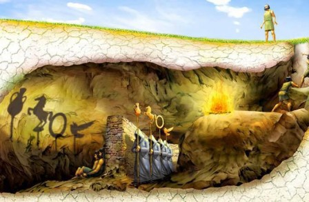

Comme on a dit hier, les addictions sont en grande partie responsables de l'inaction, et de l'inhibition de la volonté, on ne va pas revenir dessus aujourd'hui.

Par contre, j'aimerais te parler plutôt de son fonctionnement et pourquoi c'est si difficile de s'en défaire.

Si tu te souviens de la fameuse allégorie de la caverne de Socrate, Platon nous décrivais la condition d'esclave dans laquelle on peut se trouver de manière inconsciente. Ce qui est intéressant, c'est que tant que les individus ne cherchent pas à tourner la tête, ils sont totalement certains d'être parfaitement libres.

Un bon exemple sur une anecdote personnelle que je peux utiliser pour illustrer cela est qu'un jour en plein cours je devais sortir de l'amphi en plein milieu pour rencontrer quelqu'un de manière urgente. Alors, j'avais toujours cru jusque là que je suis libre de sortir de l'amphi comme je veux et sans restrictions. Seulement, j'étais pile au milieu du banc, et ma sortie devais attirer beaucoup d'attention. Donc non seulement je me suis tapé la honte, mais en sortant, l'enseignant m'a même demandé où est ce que j'allais, et il fallait donner une raison crédible pour avoir le droit de sortir.  
Malgré la liberté apparente, je me suis rendu compte que dans cette situation je n'avais que très peu de flexibilité en réalité.

Les addictions sont une **prison invisible**. La plupart des fumeurs ou buveurs compulsifs vous diront: _"J'arrête quand je veux"_; et c'est tout le principe.

L'addiction c'est juste une habitude sur-récompensée qui nous emprisonne en nous promettant d'être la seule source de plaisir dont on a besoin.  
C'est comme dans les animés où une sorcière charme le personnage principal grâce à un sortilège, et lorsque les amis du héros viennent le délivrer, elle répond qu'il lui appartient et qu'elle est la seule source de joie dont il a besoin.

Comme toute habitude, l'addiction a quatre principales phases: **Le déclencheur**, **le désir**, **la routine**, et **la récompense**.

**Le déclencheur** ce sont les éléments extérieurs ou intérieurs qui vous feront penser à votre addiction: Cela peut-être une image, une odeur, ou même une émotion comme l'ennui. C'est pour cela qu'il est contre productif d'essayer de combattre une addiction de front, car justement vous penserez sans cesse à elle puisqu'elle vous obsède, et ce sera un combat de la volonté; qui comme on l'a vu précédemment est finie. Du coup, après un moment de lutte, vous perdrez forcément, et resombrerez dans l'addiction, et culpabiliserez, et entrerez à nouveau dans cette spirale vicieuse.

La solution est donc plutôt de rendre autant que possible la source, ou plutôt le déclencheur de votre addiction invisible.

**Le désir** c'est la douleur éprouvée par l'absence de l'objet de votre convoitise et que vous avez en tête à cause du déclencheur. Dans notre cas, il s'agit de l'addiction.

La solution pour combattre le désir c'est de rendre l'objet de l'addiction détestable. Une technique utilisée souvent en cure de désintoxication est d'associer mentalement l'addiction (la drogue en général) à de la merde avec des photos des deux côte à côte.

**La routine** c'est ce que vous faites pendant l'addiction en elle même, le processus après avoir perdu à l'étape du déclencheur.

**La récompense** c'est la dopamine sécrétée artificiellement après la routine.

En fait, il n'est pas impossible de se sortir de ce trou à rat lorsqu'on connait les bons outils, il faudrait juste éviter d'utiliser les mauvaises armes; et c'est ce qui est malheureusement fait par la plupart des gens qui veulent se sortir des addictions: non seulement, ils utilisent les mauvais outils, mais ils cherchent modifier les mauvais éléments.

Cependant, il faut que je te dise une cruelle vérité: ton addiction n'est pas la cause de tous tes problèmes. Sans doute, tu penses que si tu t'en débarrasse aujourd'hui, alors tout reviendra à la normale et tu seras hyper productif, etc. Mais en réalité non, ce n'est pas vrai.

L'addiction agit sur la partie motivation, mais tu as d'autres problèmes à résoudre aussi.

Si tu as un problème d'addiction et veux discuter de ton cas spécifique, alors écrit à l'adresse mail gueyordim2020@gmail.com pour m'expliquer ton souci actuellement et on en discutera.

Vaincre ton addiction te libèrera du temps qu'il faut à tout prix remplir avec quelque chose de spécifique, sinon tu resombreras dans l'addiction.

Merci d'avoir lu jusqu'au bout.

Excellent début de weekend.
