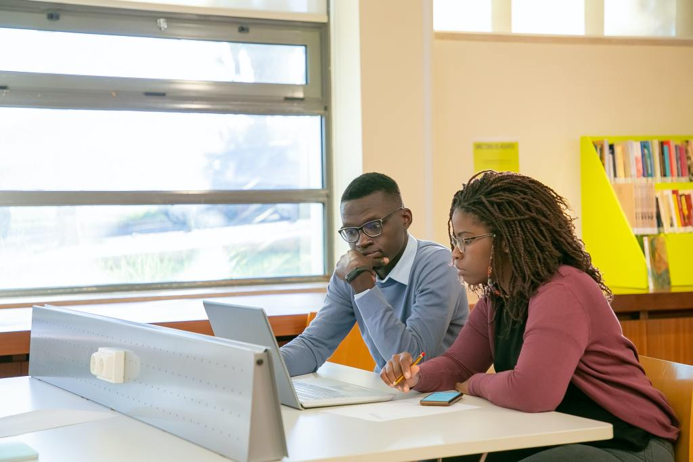

- Elle: Bonjour chéri, bien dodo?
- Lui: Oui ma puce, je viens tout juste de me réveiller et j'ai rêvé de toi. Et toi?
- Elle: Moi non, j'ai fait un cauchemar :(

Quel mal y a t'il à cela?

En soi, rien: chacun est libre de faire ce qu'il veut. Le problème ce n'est pas la notion de couple en elle même.

C'est juste que comme on le voit dans cet article, si vous avez fréquemment ce genre de discussions alors vous pouvez grandement améliorer vos résultats scolaires en corrigeant juste deux éléments dans cette discussion. C'est un peu comme avec un voile en mer: parfois il suffit de changer le cap d'un degré pour soit se retrouver au milieu de l'Atlantique, soit arriver à destination.

On ne va pas tourner autour du pot: les problèmes majeurs liés à cette discussion sont que premièrement _le gars et la fille se mettent à discuter directement au réveil_; et deuxièmement _ils se sont jetés sur leur téléphone au réveil_.

Il y a pas de magie, tout le monde sait exactement ce qu'il faut faire pour avoir des résultats scolaires incroyables: Il suffit de **travailler un peu chaque jour en mode concentré**.

C'est facile à dire, mais pourquoi est ce si difficile? Est ce de notre faute parce que nous sommes trop paresseux? Ou bien sont ce les manifestations d'une caractéristique humaine commune à tous?

Le mathématicien Cal Newport a explicité ce concept dans le livre Deep work. On sait aujourd'hui que le temps de concentration maximale d'une personne dans une journée est finie et avoisine les 4h/jour. De plus, cette concentration est plus facile à atteindre lorsqu'il n'y a pas de distractions: c'est à dire au réveil quand le cerveau est encore frais.

C'est pour cela que le matin, c'est en général plus facile de travailler et qu'il faille profiter de cet instant pour se mettre en mode deepwork de sorte à avoir un reste de la journée plus light. Vous commencez votre journée en ayant terminé les tâches les plus difficiles pendant que les autres se réveillent encore.

Entretenir sa relation de couple par texto n'a pas de problème en soi à ce niveau. Le soucis c'est juste qu'il nous entraine à nous connecter sur les réseaux sociaux et sur son téléphone très tôt; et à échéance, on gaspille nos 4h de Deep work dans du brassage de vent, des publications de blagues, alors qu'on a pas besoin de ce mode pour les faire, et ceci c'est de la gabegie.

Il n y a malheureusement pas commutativité des tâches qui nous rendent plus productif: C'est dans les heures du réveil qu'il faille être le plus productif possible.

Concrètement, voici ce que je vous conseille de faire pour avoir moins de choses difficiles à faire dans la journée:

1. Passer les premières heures de la journée sans son téléphone à se recentrer sur soi et à faire les tâches difficiles. Il vaut mieux fuir la tentation que se croire plus malin qu'elle.
2. Ne permettez pas aux notifications de vous interrompre.
3. Buvez de l'eau.

Ne vous inquiétez pas, la plupart des gens ne remarquerons même pas que vous vous êtes connectés un peu plus tard. La plupart d'entre eux sont trop centrés sur leur nombril pour se rendre compte de cela.

Ne croyez rien de cet article, testez le sur vous et vous verrez les résultats.

Pour ce qui est de votre couple maintenant. Evidemment, cela peut être difficile pour votre partenaire si vous l'avez habitué à lui répondre spontanément dès votre réveil que vous pensez à lui/elle, etc. Il y a deux approches possibles pour vous en sortir sans bleus.

Soit vous vous réveillez plus tôt que d'habitude pour pouvoir exploiter la puissance de votre DeepWork, soit vous lui envoyer cet article pour lui faire comprendre la consistance de votre démarche.

Il vaut bien mieux d'utiliser votre mode DeepWork pour traiter des tâches complexes que pour faire des choses plus simples comme envoyer des émojis qui en soi ne nécessitent pas ce mode.

Merci d'avoir lu cet article jusqu'à la fin.

Sinon, si les thématiques sur l’apprentissage, la concentration, l’orientation académique, la productivité te parlent, alors tu peux t’inscrire gratuitement à ma liste email en allant sur le [lien](https://mailchi.mp/dcd3b580d01e/conseils-productivit). C’est un format plus intime pour recevoir mes conseils les plus profonds.

Excellente journée.
