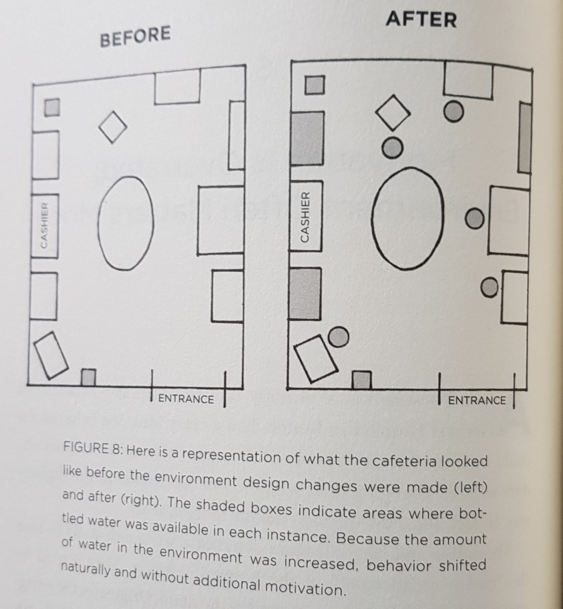

Un ami m’a fait une remarque pertinente il y a trois semaines : _‘’Une cuisine propre donne vachement envie de cuisiner ! ’’._

Si vous ne vivez plus chez vos parents, vous voyez exactement de quoi il parle : Avoir une cuisine rangée prévient du désir de manger dehors.

On peut transposer ce phénomène dans presque tous les domaines : un lit rangé donne envie de s’y allonger, des toilettes propres donnent envie de les utiliser, une route droite donne envie de la pratiquer.

Si vous avez cliqué sur ce lien, alors je parie que vous avez du mal à débuter des tâches difficiles comme étudier ou bien vous entrainer à la musique. Peut-être même que vous êtes sensés le faire maintenant, mais au lieu de ça vous êtes là à surfer sur internet en train de lire un article qui vous explique comment faire la tâche que vous êtes sensé faire.

Il y a fort à parier dans ce cas que votre mise en place pour faire ces tâches dures soit fastidieuse. C’est le vrai problème ! Ce n’est ni vous, ni votre volonté le problème, mais bien les efforts à fournir pour faire la tâche.

Beaucoup de gens mettent (inconsciemment généralement) plein d’étapes pour débuter les tâches difficiles : s’installer dans une nouvelle pièce, sortir leurs affaires, etc. ; ils comptent sur la motivation pour avoir envie d’effectuer ces tâches. Et quand ils échouent, ils appellent ça la fatalité.

Ils finissent par penser qu’ils sont paresseux, et qu’ils ont besoin d’être bousculé pour avancer.

Du coup, ils glissent dans des actions faciles sur le moment : Télé (Il suffit d’appuyer sur un bouton), YouTube, Facebook, Tiktok qu’ils ne considèrent eux même pas comme très importantes sur le moment.

La vérité est à la fois plus difficile, et plus simple : bien des fois, nous n’avons même pas besoin d’être tenté par satan ; nous nous soumettons nous même à la tentation.

A ce niveau, vous avez deux possibilités : soit vous fermez cette page web, et vous continuez éventuellement à espérer être motivés pour faire des tâches difficiles ; soit vous cherchez une VRAIE solution pour augmenter vos chances de débuter vos tâches difficiles même les jours où vous êtes moins motivés.

Je vous propose dans cette publication une méthode simple pour hacker votre cerveau pour qu’il aime faire des choses dures : des choses que la plupart des gens refuseront de faire, mais qui vous apporterons bien plus de valeur que de surfer sur Instagram.

1. **La motivation est surcotée : l’environnement compte souvent bien plus**

L’idée de cette publication me vient d’une anecdote du livre Atomic Habits.

C’est l’histoire de Anne Thorndike : une femme médecin persuadée qu’elle pouvait améliorer les habitudes alimentaires du staff médical sans jouer ni sur leur motivation ni sur leur volonté.

La seule chose qu’elle a fait modifier à l’hôpital était la position des points d’eau et des boissons sucrées.

Les points d’eau ont été **rendus visibles** ; et les boissons sucrées étaient toujours présentes, mais dans des coins obscurs ; si bien que pour en avoir, il fallait vraiment faire l’effort d’aller au fin fond tu treizième couloir, de prendre trois virages et d’allumer la machine.

Image

<figure>

<figcaption>

Atomic Habits

</figcaption>

</figure>

Pas un mot n’a été dit, ni de discours moralisateur, ni de discours inspirationnel.

Est-ce que vous vous rendez compte de ce que je vous vends comme idée là ?! C’est comme si je vous disais que commencer à lire un cours difficile devenait aussi simple que de cliquer sur une application comme Snapchat ; Pendant qu’au même moment pour vous connecter sur Facebook vous devez : y penser, vous lever, arranger vos affaires, changer de pièce, aller dans une salle très éloignée, organiser vos affaires, vous installer, et commencer à utiliser l’application.

Nous ne choisissons pas forcément de faire des actions à cause des actions elles même. Bien des fois, c’est juste une question d’accessibilité et de visibilité.

Parfois, nous prenons des œufs pour les cuisiner juste parce qu’on les a vu. Nous mangeons cette banane parce qu’elle était sur la table. Nous ouvrons ce réseau social parce que nous avons reçu une notification. Nous regardons l’heure régulièrement parce que nous avons une montre.

Et de plus en plus, ces éléments de notre environnement façonnent la manière dont nous nous comportons au quotidien.

C’est comme cela : L’homme façonne le monde qui le façonne en retour.

La première barrière pour commencer à lire un cours est parfois juste d’ouvrir notre sac.

La bonne nouvelle de cela, c’est que si vous avez compris et intégré cette réalité, alors vous pouvez échapper à la fatalité d’être esclave de votre environnement en le réorganisant de manière plus astucieuse.

Seulement, vous devez vraiment intégrer profondément ces concepts : pas seulement intellectuellement ; mais aussi vraiment le ressentir profondément intérieurement.

Si vous me suivez jusque-là, vous devez commencer à voir là où je veux en venir : votre environnement de travail devrait être **facile d’accès**, **visible** et **attractif** si vous voulez avoir envie de démarrer le travail.

Déjà, si vous n’avez pas un lieu précis où vous travaillez d’habitude ; alors il peut être une bonne idée d’y penser. L’idée c’est toujours de chercher à minimiser l’effort de volonté pour débuter une tâche. Réfléchir sur l’endroit où vous allez débuter la tâche c’est déjà un obstacle artificiel que vous ajouteriez entre vous et la tâche ; et l’idée est plutôt de minimiser à chaque fois les obstacles.

De même que l’onglet de YouTube est toujours à la même position dans votre téléphone, avoir une place habituelle pour la tâche vous économisera en réflexion et vous évitera de mauvaises décisions comme décider d’étudier ‘’un peu’’ sur le lit ; et de se réveiller le lendemain matin, 5 minutes après…

Dans le même temps, je vous propose de retirer les raccourcis d’onglets et les notifications de vos réseaux sociaux.

Posons-nous deux secondes la question : _Avons-nous vraiment besoin que ce soit si facile de se connecter ?_

C’est le défi que je vous propose : rendre difficile l’accès à ces réseaux pendant 1 semaine, de cette manière, vous fournirez un effort pour pouvoir vous connecter et donc ne le ferez que lorsque c’est vraiment important.

Je suis aussi passé par cette cure de désintoxication, et c’est salutaire je vous promets. C’est évidemment difficile : comme pour la drogue, il y a toujours cette période de sevrage qui parait impossible à tenir. Mais bien exécuté, ils donnent des résultats immédiats !

Vous vous dites peut-être que si vous le faite, alors les gens de votre entourage vous demanderont sans doute pourquoi vous n'êtes plus connectés en permanence. Mais c’est surestimer le degré d’intérêts des autres par rapport à votre activité sur les réseaux sociaux. La plupart de vos amis ont une liste bien longue de problèmes à leur actif, et que vous soyez moins actif est surement bien en bas dans la liste. Dans tous les cas, je vous propose d’essayer 1 semaine juste pour voir de vous-même se qui se passera.

2. **Organiser son environnement de travail avec la méthode japonaise des 5 S**

Dans cette section, je vais supposer que vous avez déjà un lieu fixe pour votre tâche difficile. Il s’agit maintenant d’appliquer une méthode ninja pour rendre ce lieu attractif, et énergiquement économique.

Vous avez besoin de votre force d’attention pour ce qui est important pour vous, il ne faut pas la gaspiller. C’est l’objectif de la méthode des 5 S : _Seiri_ (整理, _ranger_), _Seiton_ (整頓, _ordre_), _Seiso_ (清掃, _nettoyage_), _Seiketsu_ (清潔, _propre_), _Shitsuke_ (躾, _éducation_).

Chaque S a un objectif propre: _Seiri_ vise à alléger l’espace de travail de ce qui est inutile, _Seiton_ à l’organiser de façon efficace, _Seiso_ a pour but d’améliorer l’état de propreté des lieux, _Seiketsu_ est destiné à prévenir l’apparition de la saleté et du désordre et _Shitsuke_ va encourager les efforts allant dans ce sens.

Je ne vous demande pas de retenir tout ceci. Prenez cette publication comme un tutoriel, appliquez la juste machinalement et revenez-y à chaque fois que vous voulez bien vous rappeler des étapes de cette méthode. N’oubliez pas que votre créativité doit vous servir dans ce qui est important pour vous, il vaut mieux la conserver que de l’utiliser pour la mise en place.

a. **_Seiri_ (supprimer)**

Lors de cette étape, il s'agit d'éliminer toute chose qui n'a pas sa place dans l'espace de travail.

Beaucoup de personnes disent qu’elles ne veulent pas se débarrasser de certaines affaires car ‘’Elles pourront servir un jour’’.

C’est de la paresse déguisée selon moi.

Même si elles ‘’serviront peut-être un jour’’, j’ai envie de dire : Et alors ?

Vous ne l’aurez juste pas ce jour-là et vous trouverez une solution. Laissez demain s’inquiéter de lui-même. Entre temps, ne laissez pas votre quotidien être obscurci par la crainte de l’avenir. On apprend avec douleur à se détacher des objets, mais c’est mieux de s’en détacher en général. Toute attache matérielle se transforme toujours tôt ou tard en une faiblesse.

Quelques règles permettent de savoir quoi garder et où :

- Tout ce qui ne sert pas (ou plus) depuis un an est jeté ;
- De ce qui reste, tout ce qui sert moins d'une fois par mois est mis à l'écart (par exemple, au fond d’un tiroir que vous ne consultez jamais) ;
- De ce qui reste, tout ce qui sert moins d'une fois par semaine est mis à proximité (typiquement dans une armoire de bureau si vous en avez) ;
- De ce qui reste, tout ce qui sert moins d'une fois par jour est au lieu de travail (accessible sans se lever) ;
- De ce qui reste, tout ce qui sert moins d'une fois par heure est au lieu de travail, directement à portée de main, bien visible et ouvert (laissez un cahier ouvert à la fin de votre session de travail pour que ce soit facile de démarrer prochainement).
- Et ce qui sert au moins une fois par heure est directement utilisée.

Cette hiérarchisation du matériel de travail conduit logiquement à _Seiton._

b. **_Seiton_ (situer)**

Cette étape consiste à ranger les différents outils et matériels pour le travail. L’idée de _Seiton_ est : « Une place pour chaque chose, et chaque chose à sa place ».

Il faut savoir que plus un bureau est grand, plus on a tendance à étaler ses affaires : c’est la loi de Douglas en théorie de la productivité.

Lors de l’étape _Seiton_, on cherche à aménager l'espace de travail de façon à éviter les pertes de temps et d'énergie.

Les règles de _Seiton_ :

- Ranger de façon rationnelle le poste de travail (proximité, objets lourds faciles à prendre ou sur support, …) ;
- Définir les règles de rangement ;
- Rendre évident le placement des objets (Ne mettez pas le Bic dans le 5ème tiroir) ;
- Mettre les objets d'utilisation fréquente près de l'opérateur ;
- Classer les objets par ordre d'utilisation ;
- Standardiser les postes (Ne changez pas les postes) ;
- Favoriser le « [FIFO](https://fr.wikipedia.org/wiki/First_in,_first_out) » (_First in, First out_).

c. **_Seiso_ (faire scintiller)**

Une fois l'espace de travail dégagé (_Seiri_) et rangé (_Seiton_), il est beaucoup plus facile de le nettoyer. Le non-respect de la propreté peut dégouter du lieu de travail et faire préférer Netflix.

Quelques règles du _Seiso_ :

- Décrasser, inspecter, détecter les anomalies ;
- Remettre systématiquement en état ;
- Faciliter le nettoyage et l'inspection ;
- Supprimer l'anomalie à la source s’il y en a.

d. **_Seiketsu_ (standardiser)**

Le système des 5S est effectivement souvent appliqué en opération ponctuelle. _Seiketsu_ rappelle que l'ordre et la propreté sont à maintenir tous les jours.

e. **_Shitsuke_ (suivre)**

Cette étape est celle du contrôle rigoureux de l'application du système 5S. Si celui-ci est appliqué sans la rigueur nécessaire, il perd en effet toute son efficacité. Une vérification fiable des quatre premiers 'S’ sont les moteurs de cette étape.

**3\. Exemple pratique**

Pour que vous ne soyez pas perdus dans toute cette théorie, je vais vous prendre quelques exemples pratiques issus de mon propre environnement. Pas que je sois parfait, et pas que vous devriez copier ce que je propose, mais juste pour vous donner concrètement quelques pistes que vous pouvez exploiter pour vous-même.

**Exemple 1 :** Au chevet de mon lit, j’ai un livre qui est ouvert. Ceci me suggère : ‘’Hé Didier, n’oublie pas de lire aujourd’hui’’.

**Exemple 2 :** Sous mon oreiller, j’ai ma Bible. Ceci me suggère : ‘’Hé Didier, n’oublie pas de prier aujourd’hui’’.

**Exemple 3 :** Sur ma table de travail, j’ai une feuille blanche juste avec un stylo à côté. Ceci me suggère : ‘’Hé Didier, n’oublie pas d’écrire aujourd’hui’’ (alors même que je n’écris que sur mon ordinateur).

**Exemple 4 :** Dans mon bureau à l’université, j’ai un tableau noir directement visible. Ceci me suggère : ‘’Hé Didier, n’oublie pas de faire des maths aujourd’hui’’ (Ceci je ne l’ai pas décidé, mais c’était une opportunité bien placée).

**Exemple 5 :** En fond d’écran de mon téléphone j’ai ma famille. Ceci me suggère : ‘’Hé Didier, pense à ta famille aujourd’hui’’.

**Exemple 6 :** A côté de mon lit et sur mon bureau, j’ai une gourde pleine d’eau respectivement. Ceci me suggère : ‘’Hé Didier, boit de l’eau aujourd’hui’’.

**4\. Les erreurs**

Evidemment, il y a des dérives dont je devrais vous mettre en garde.

Je vous déconseille d’écrire vos objectifs et de les afficher partout dans votre environnement comme le suggère certains formateurs de développement personnel.

J’ai déjà fait une publication dans laquelle j’explique les dérives de certains penchants du développement personnel, je ne reviens plus dessus, voici le [lien](https://www.afrik-view.com/reflexion-le-probleme-avec-les-citations-inspirantes-la-toxicite-positive-les-faux-gourous-la-loi-de-lattraction/).

Le problème si vous vous entourez en permanence de vos objectifs est que vous y penserez sans cesse ; ils vous rappelleront juste que vous n’y êtes pas encore. Ce n’est pas en pensant à eux qu’ils se réaliseront, mais plutôt étant plutôt concentré sur les étapes qui permettent en fait d’y arriver en fait: Vous aurez juste un stress artificiel.

Le pire c’est que je me rends de plus en plus compte que les personnes que je connais qui consomment régulièrement des contenus de développement semblent devenir de plus en plus égoïste et autocentrés. Ceux autour de nous deviennent alors des obstacles, des personnes limitées, des personnes toxiques (dans le jargon) parce qu’elles ne nous permettent pas d’accomplir nos objectifs à nous qui sommes parfaits, et spéciaux.

Je suis vraiment désolé de vous le dire les amis, mais vous n’êtes pas spéciaux… Vous êtes unique, mais vous n’êtes pas spécial. Vous ne méritez pas plus que quelqu’un d’autre de faire des choses extraordinaires.

Je sais que c’est embêtant de l’entendre à cause de toute cette nouvelle culture, ces blogs de spiritualité qui vous disent à quel point vous êtes incroyables ; et que pendant que vous bosser dur dans l’ombre et que d’autres perdent leur temps dans des soirées mondaines, vous vous évoluez.

Ce n’est évidemment pas par plaisir ou bien pour vous casser que je vous dis cela, mais parce que c’est je crois plus sain à écouter comme discours. Si les choses ne sont pas remises à leur place, on assiste à un déni du réel et un entubage industriel de nos systèmes de pensées.

Quand nous apprenons à accepter que nos efforts ne seront pas forcément récompensés comme nous pensons, nous pouvons au lieu de réinterpréter le réel, nous donner le luxe de ne pas être parfaits, réapprendre à aimer les autres honnêtement avec leurs imperfections.

Evidemment comme d’habitude, je ne fais que vous proposer un système de pensée pour faire de réel progrès : vous avez la liberté de croyance.

**5\. Faites entendre ce message**

J’ai découvert dernièrement que plusieurs personnes aiment bien les contenus de Guèyordim. Si c’est votre cas, et que cette publication vous a touché, dites-vous bien qu’elle peut sans doute toucher quelqu’un d’autre.

Evidemment, c’est loin d’être le style de publications partagées régulièrement, mais si vous voulez faire réaliser quelque chose à quelqu’un que vous aimez, alors vous pouvez lui passer directement le lien de cette publication. Ni Facebook, ni Google ne pourra le faire pour vous; mais si vous le faites, vous pouvez provoquer le déclic chez quelqu’un.

A très Bientôt,

Alain Didier.
