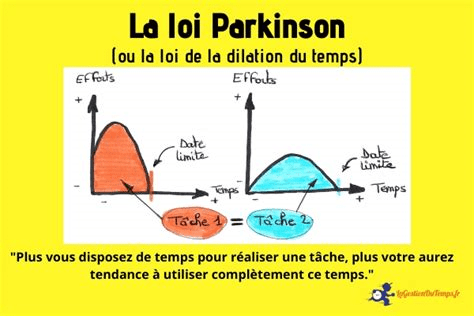

Pour ne plus être de la dernière minute avant un examen, il faut que la dernière minute soit passée avant.

C’est bizarre, cette énergie développée à la veille d’un examen, ou bien d’une date limite pour rendre un projet. Evidemment, on se dit après coup qu’on aurait fait sans doute mieux si on avait travaillé aussi intensément depuis le début. Figure-toi que c’est possible, et je te dirais dans cette publication comment.

Je vais te faire une confidence : tout travail ou toute activité tend à occuper l’ensemble du temps qui lui est réservé.

Je vais prendre un exemple. Si on te donne une dissertation de 2h à réaliser sur le sujet de la productivité, alors tu mettras 2h à terminer celle-ci. Si en revanche, on te l’avait donné en devoir maison pour une journée, alors tu l’aurais fait en une journée (et peut-être même tu aurais terminé la matinée du cours 😊). Si on te l’avait donné en deux semaines pour les congés de pâques, alors idem: peut-être tu l’aurais fait sur Word, mis des couleurs, mais tu l'aurais fais en deux semaines. Ceci s’applique à tous les domaines, même non scolaires ; il suffit de voir la cuisine lors des réunions organisées à la maison ou bien des tontines.

En fait, ce principe est bien connu dans l’univers de la productivité sous le nom de la **loi de Parkinson** ou bien **loi de dilatation du temps**.

<figure>

<figcaption>

lagestiondutemps.fr

</figcaption>

</figure>

En gros, elle stipule que les choses tendent à s'étaler pour occuper tout le temps qui leur est imparti.

La solution à cela n’est pas de se croire plus malin que des lois humaines qui ont pris des millénaires à se former. Nous sommes vraiment des procrastinateurs dans l’âme qui avons besoin de carotte et de bâton pour avancer.

La solution à cela n’est pas non plus de compter sur la motivation.

La solution c’est plutôt d’utiliser cette loi de ton côté en modifiant ta perception de la deadline. C’est super important. Si tu as par exemple un examen mercredi, l’idée c’est de parvenir à te convaincre **intrinsèquement** que ton examen a lieu mardi plutôt. Il ne s’agit pas juste de te le dire comme ça rapidement à la va vite, mais de te persuader qu’effectivement c’est ta vraie nouvelle date d’examen et te comporter comme tel.

La première étape est de l’écrire sur un bout de papier. C’est 10 secondes, mais cela te permettra de faire ce switch mental déjà. Il faut t'entourer au maximum de cette nouvelle information: tu peux coller des post-it partout, l'écrire en fond d'écran de ton téléphone ou de ta machine. L'autre avantage de cela en plus de te conditionner est de te rappeler en cas d'oubli.

La deuxième étape est de te mettre dans l’état mental de quelqu’un qui a un examen ce nouveau jour-là, et de te demander si dans ce cas, Facebook est vraiment le lieu où tu dois être maintenant.

La troisième étape est de te mettre au boulot.

Si ce type d’informations t’intéresse, je t’invite à t’inscrire à la [newsletter](https://mailchi.mp/dcd3b580d01e/conseils-productivit) en recevoir de plus profondes même.

Excellent week-end à toi.
