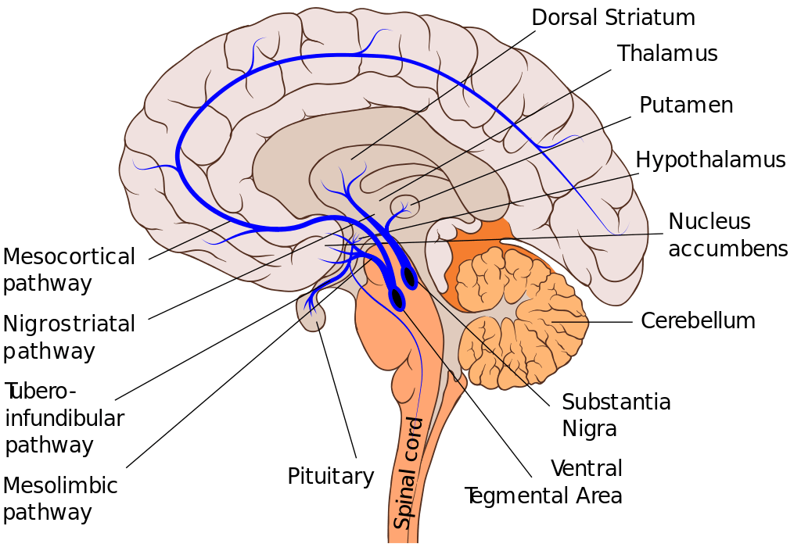

Il y a une barrière mentale avec laquelle on a tous grandi. C’est celle qu’un adulte se défini par le métier qu’il fait : _‘’Il est Professeur’’,_ _‘’Il est Ingénieur’’,_ _‘’Il est médecin’’_, _‘’Il est Homme d’affaire’’,_ etc.

Et plus on creuse, plus les différences d’identités se marquent : Un matheux va mépriser un physicien parce qu’il le trouve trop peu rigoureux ; et un physicien va mépriser un matheux parce qu’il le trouve trop carré et borné.

Même dans les spécialités, ce genre de guéguerre persiste : Un matheux appliqué va trouver qu’un matheux puriste reste dans les abstractions des nuages sans rien de concret derrière ; et un matheux puriste va penser qu’un appliqué fuis la difficulté pour faire des choses faciles.

Plus vous vous spécialisez, plus vous avez de chance si vous ne faites pas attention de devenir fermé d’esprit. Et en même temps, _**plus vous vous diversifiez, plus vous pouvez ajouter de valeur à votre spécialité.**_

Un bon exemple de cela c’est si vous êtes médecin spécialiste de la neurochirurgie. Vous êtes tellement pointu que vous êtes techniquement l’un des meilleurs mondiaux dans votre domaine. Seulement, vous n’avez aucune compétence en communication et très peu en médecine générale. Votre problème de communication pourrait faire en sorte que personne ne soit au courant de vos compétences ; et votre non-maitrise de la médecine générale pourrait faire que les rares qui viendraient dans votre cabinet mourraient s’ils ont juste une grippe, et non pas une tumeur du cerveau parce que ‘’ce n’était pas votre domaine’’.

Oui, c’est vrai, il y a des spécialistes très pointus qui vont prospérer par chance, parce qu’ils ont rencontré quelqu’un qui leur a permis de briller, ou bien dont le travail a été mis en valeur pour une occasion spécifique. On parlera de ceux-là à la télévision en ne mettant en avant que leur compétence en renvoyant le message : _‘’Concentrez-vous exclusivement sur un domaine et devenez le meilleur dedans’’._ Mais on ne parlera jamais des 99% de personnes (dont vous ferez peut-être parti) au moins aussi compétentes mais qui sont dans l’ombre parce qu’ils n’ont pas eu autant de chance.

Vous, vous ne voulez pas vous en remettre exclusivement à la chance ; mais peut-être êtes encore prisonnier de cette barrière psychologique ? : _‘’Je suis un avocat et je n’ai pas à apprendre des statistiques ; et de toute façon, je peux l’apprendre quand je veux vu que ça se trouve sur Google’’._

Google nous donne l’illusion que toutes les informations sont disponibles facilement, et du coup, il n’y a pas à faire d’effort pour apprendre de nouvelles compétences.

_"Après tout, si je veux une information, je la cherche sur Google. Pour quelle raison devrais je m'encombrer l'esprit avec des connaissances inutiles?"_

Si vous vous êtes déjà retrouvés dans un pays étranger dont vous ne maitrisez pas la langue et que vous vous êtes retrouvé contraint à compter sur Google traduction pour communiquer, vous comprendriez très vite les limites de cette utilisation de Google : C’est bizarre et imprécis.

Une compétence développée ce ne sont pas juste des informations accumulées. Ce sont des informations pratiquées délibérément, et agencées dans l’ordre pour les combiner et répondre à un problème précis.

C’est ça que Google n’est pas capable de faire pour le moment.

Evidemment, ceci ne s’applique pas à tout le monde. Il y a des gens qui sont tout à fait à l’aise à avoir toute leur vie une seule compétence et être tranquille. Ceux-là ne sont pas concernés par cette publication.

En revanche, il y a aussi une catégorie de personnes qui a en réalité besoin de faire plusieurs choses différentes pour être épanouie, mais qui est frustrée par un entourage qui lui demande de ne pas se disperser. On les appelle les **slasheurs**.

Voici un test que j’ai trouvé en ligne qui peut vous permettre de découvrir si vous êtes plus ou moins un slasleur : [test](https://www.youtube.com/watch?v=ODcRB1Ap1Vo).

Si vous êtes un slasheur, voici 3 bonnes raisons de prendre du temps pour apprendre de nouvelles compétences :

- **Plus vous vous concentrer sur un même sujet, moins il a de l’intérêt pour vous** : Et ceci est vrai même si de base ce sujet vous passionnait. C’est à cause d’une zone du cerveau qui s’appelle le **striatum dorsal**.

Elle est située juste en dessus du corps noir. Le corps noir c’est le réseau de neurones responsable de la sécrétion de la dopamine (on l’appelle corps noir car les neurones en jeu sont noirâtres, comparé aux autres neurones qui sont plus clairs).

<figure>

<figcaption>

commons.wikimedia.org

</figcaption>

</figure>

Le striatum dorsal est souvent considéré comme la zone responsable de la motivation, et plus vous voyez un même concept/une même personne, moins elle peut avoir de l’intérêt pour vous (sauf s’il a des attributs différents). Il peut donc être plus palpitant pour vous de switcher d’un domaine à un autre et vice versa.

- **Pour voir des opportunités là où les autres voient des problèmes, il vous faut avoir une manière _différente_ de voir les choses**. Le problème, c’est que les individus d’un même environnement ont tendance à réfléchir de la même manière.

Lorsque la société d’électricité Eneo coupe le courant par exemple, pendant que tout le monde dira qu’il faut que le délégué du gouvernement quitte ; si vous avez des compétences en électricité, vous pouvez profiter de cette faille pour proposer un système d’énergie efficace pour une maison que vous pourrez vendre à ceux qui se plaignent. Ou bien vous pouvez au moins faire des recherches réelles pour comprendre la vraie raison pour laquelle il y a des coupures de courant (sans les aprioris que vous avez sans doute actuellement).

- **Pour développer votre esprit créatif**. Il y a une catégorie de personne qui ont des neurones en pleine expansion. C’est ce qu’on appelle de la **neuroplasticité**. Ce qui caractérise ces personnes c’est qu’elles ne cessent de vouloir apprendre de nouvelles choses. Et étrangement, des nouvelles approches mènent souvent à des résultats plutôt inventifs.

Par exemple, j’ai volé le titre de cette publication (Comment combattre google et gagner) d’une histoire assez racontée dans le monde du Copywriting : c’est l'histoire d'un monsieur qui voulait écrire un livre sur le cancer. Le titre de son livre était : _L’encyclopédie du cancer_, et le livre ne se vendait pas bien.

Après avoir travaillé avec un copywriter, sans changer le contenu du livre le copywriter a suggérer de modifier uniquement le titre par : _Comment combattre le cancer et gagner_. Et du jour au lendemain, livre a explosé son nombre de ventes.

Et voici comment des éléments pris du Copywriting (qui n’a rien à voir avec l’apprentissage) se mélangent avec notre thématique pour donner un titre qui peut être plus accrocheur qu'un titre plus ennuyeux comme : Pourquoi apprendre de nouvelles compétences.

a

**Comment combattre Google et Gagner**

Evidemment, il ne suffit pas de vouloir développer des compétences pour être plus compétent. Il faut apprendre et pratiquer.

Après avoir étudié toutes les formes de transmission de savoir, je suis arrivé à la conclusion suivante : La meilleure manière d’apprendre une compétence, **c’est auprès de quelqu’un qui l’a déjà développée et qui l’enseigne.**

La deuxième meilleure manière, **c’est dans les livres**.

Le pire endroit où chercher une information fiable c’est évidemment à la télé, dans les films, et sur les sites de streaming en ligne.

Sur un site comme YouTube, on ne peut faire que de la vulgarisation d’un domaine. Et pour vulgariser, il faut forcément se tromper. Si on veut être plus précis, on doit utiliser des termes techniques qui perdraient le grand public (et on aurait pas de vues).

Mais si vous voulez avoir une vraie compétence solide, et que vous n'avez personne qui puisse vous l'apprendre, alors vous devez vous asseoir pour lire des livres en autodidacte.

Les livres ont plus d’espace pour pouvoir développer, et donc donner une vision globale de la compétence en jeu. La dernière étape est de pratiquer les exercices proposés de manière délibérée pour ne pas juste accumuler des connaissances, mais bel et bien faire de vrais progrès.

Si ce genre de contenu vous plait, alors je vous recommande de vous inscrire à la [Newsletter](https://mailchi.mp/043d8982459e/gueyordimnewsletter) pour avoir des informations bien plus importantes.

Portez-vous bien.
