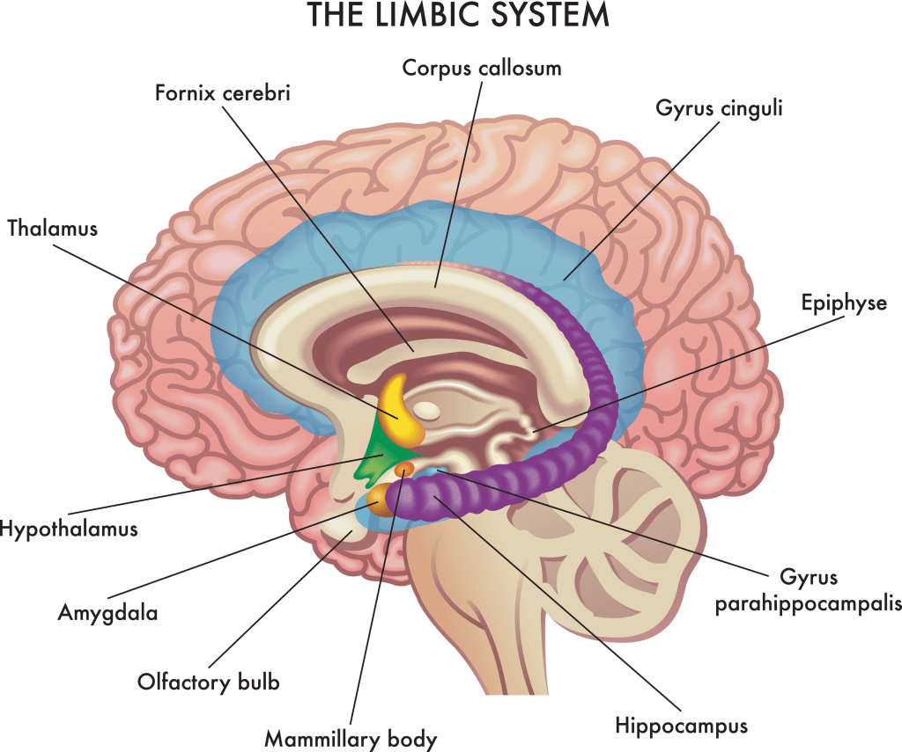

Bonjour à tous, c'est Alain Didier.

Si vous êtes des habitués de ce blog, vous savez que nous avons une tradition. Depuis maintenant trois ans, je laisse toujours un article "phare" en fin d'année. Ce n'est pas un article de vœux classiques, mais une brique méthodologique pour vous aider à devenir plus productifs et pertinents dans votre quotidien.

Si on regarde en arrière, il y a une logique implacable dans ce que nous avons construit ensemble :

- **Il y a deux ans**, nous avons vu [comment se fixer des objectifs](https://gueyordimcom.wordpress.com/2024/01/12/ma-methode-pour-tenir-les-resolutions-du-nouvel-an-trouver-votre-ikigai/) (Le Cap).

- **L'année dernière**, nous avons appris à [faire un bilan annuel rigoureux](https://gueyordimcom.wordpress.com/2024/12/28/transformez-vos-erreurs-en-succes-le-bilan-annuel/) pour ne pas se mentir à soi-même (Le Feedback).

Logiquement, si vous avez appliqué ces méthodes, vous devriez être au sommet de votre art. Les plus assidus d'entre vous ont développé une véritable expertise en planification. Vous savez utiliser Google Calendar, vous connaissez la méthode SMART, vous avez peut-être même lu _Atomic Habits_. Sur le papier, vous êtes des machines de guerre.

Et pourtant... Je reçois encore des messages de détresse. Au quotidien, malgré les agendas colorés et les "To-Do lists" parfaites, l'exécution ne suit pas. Il y a un fossé grandissant entre la beauté de vos plans et la réalité de vos journées. Il vous manque un "je ne sais quoi" difficilement descriptible qui vous empêche de libérer votre plein potentiel. Tout se passe comme si vous aviez une Ferrari pleine d'essence et prête à rouler, un GPS configuré et montrant le chemin exact pour arriver, mais que vous n'arrivez pas à démarrer.

C'est pour cela que le message de 2026 est crucial. C'est la pièce manquante du puzzle. Si les années précédentes étaient consacrées à l' "Essence" et au "GPS", 2026 doit être consacrée au "Moteur".

Pour que vous visualisiez clairement ce que je veux dire, voici l'histoire réelle d'un cadet à moi étudiant à Polytechnique que l'on va appeler Cédric. Et je prends le temps de vous la raconter en détail car je soupçonne qu'elle va résonner douloureusement chez beaucoup d'entre vous. Cela pourra vous faire mal de le lire, mais cela vous fera du bien de voir la vérité en face.

### L’Architecte de l’Échec

Cédric n'est pas paresseux. Au contraire, c'est ce qu'on pourrait appeler un "Architecte". Si vous ouvrez son ordinateur, son Google Agenda est une œuvre d’art contemporaine. Tout est catégorisé : le bleu roi pour les cours magistraux, le vert pomme pour le sport, le rouge pour les sessions de révision intense. Il utilise Notion, il a des rappels sur son téléphone, il a même optimisé son sommeil.

Nous sommes à la veille de son examen final de Thermodynamique. Il est 3h14 du matin. Selon son plan parfait --celui qu'il a conçu avec fierté il y a trois mois-- cette plage horaire devait être consacrée au sommeil réparateur, juste après une séance de "relecture légère et confiante" prévue entre 20h00 et 22h00.

Mais la réalité de 3h14 est bien plus sombre. Cédric est assis dans le noir, éclairé par la lumière bleue de son écran. Il transpire. Ses yeux sont injectés de sang. Il n’est pas en train de dormir. Il n’est même pas en train de "relire". Il est à la page 12 du manuel d'introduction. Il est en train d'essayer de **comprendre** et d'apprendre pour la première fois des concepts fondamentaux qu’il aurait dû maîtriser en octobre.

Le silence de sa chambre est assourdissant. Il regarde son agenda qui affiche "Sommeil", puis il regarde son cours qu'il ne comprend pas. Cédric réalise avec horreur que son organisation parfaite n’était qu’un puissant analgésique. Pendant des mois, planifier lui a donné l'impression d'agir. Déplacer un bloc "Révision" du mardi au jeudi lui donnait une petite décharge de satisfaction, comme s'il avait résolu le problème.

Il a repoussé la douleur de l’effort chaque jour, petit à petit, en négociant avec son calendrier. Mais la vie est un créancier patient et impitoyable. Ce soir, à 3h14, le serveur vient de déposer la facture sur la table. Et la règle économique est cruelle : **Plus il a attendu, plus l’addition est salée.**

* * *

Ce message est long, et c'est volontaire. Je ne suis pas là pour vous donner une astuce rapide de 30 secondes, mais bien pour changer votre logiciel mental au complet. Il n'est pas fait pour tout le monde, il faut de la persévérance. Si vous allez jusqu'au bout, vous êtes vraiment différents de la majorité. Et peut-être vous trouverez une pépite qui vous suivra sur toute la deuxième partie de cette décennie.

Pour que 2026 ne soit pas une simple répétition de 2025, nous allons procéder avec méthode. Dans la suite de cet article, nous allons aborder trois points cruciaux :

1. **Le Mécanisme Invisible :** Nous allons d'abord comprendre pourquoi vous avez l'illusion d'être productif alors que vous faites du surplace.

3. **Le Dressage Mental :** Je vais vous dévoiler une méthode radicale, à la frontière du "Bio-hacking" et de l'art martial, pour forcer votre cerveau à passer à l'action.

5. **Les 3 Systèmes Indispensables :** Enfin, je vous donnerai les trois chantiers prioritaires sur lesquels vous devez bâtir des systèmes en 2026 (Santé, Travail, et Softskills face à l'IA) pour sécuriser votre avenir.

Prêts ? Allons ouvrir le capot.

* * *

### I. L'Illusion de la Productivité : Pourquoi être "occupé" ne veut pas dire "avancer"

Si Cédric est à Polytechnique, c'est qu'il est brillant. S'il a un agenda si bien rempli, c'est qu'il est volontaire. Alors, pourquoi échoue-t-il ? Pour comprendre ce paradoxe, il faut introduire une distinction fondamentale que 99% des gens ignorent. Une distinction qui explique pourquoi vous pouvez passer 8 heures au bureau ou à la bibliothèque et rentrer chez vous avec le sentiment de n'avoir rien fait.

C'est la différence entre être en **Mouvement** et être en **Action**.

Cela semble être la même chose, mais ce sont deux univers opposés.

- **Être en Mouvement**, c'est planifier, chercher des stratégies, apprendre une nouvelle méthode d'organisation, acheter des cahiers, colorier son agenda.

- **Être en Action**, c'est effectuer la tâche qui produit directement le résultat.

Laissez-moi vous donner des exemples concrets :

- Si je cherche "le meilleur régime pour perdre du poids" sur Google et que j'achète des chaussure de course : je suis en **Mouvement**.

- Si je mange un repas sain et que je cours 5km : je suis en **Action**.

- Si Cédric passe 1 heure à colorier son emploi du temps sur Notion : il est en **Mouvement**.

- S'il ferme Notion, ouvre son livre de Thermodynamique et lit une phrase difficile : il est en **Action**.

**Le Piège Mortel du Mouvement**

Le problème, c'est que le Mouvement est un maître de l'illusion. Quand vous planifiez, vous avez l'impression d'avancer. Vous vous sentez productif. Mais c'est un mensonge. Le Mouvement, c'est comme faire vrombir le moteur de votre Ferrari au point mort. Ça fait du bruit, ça consomme de l'essence, les gens vous regardent... mais la voiture n'a pas avancé d'un seul centimètre.

Pourquoi Cédric (et peut-être vous) passe-t-il autant de temps en Mouvement ? Parce que le Mouvement est **sécurisant**. Quand vous planifiez, vous ne pouvez pas échouer. L'Action, en revanche, est terrifiante car elle implique un risque d'échec immédiat. Pour 2026, vous n'avez pas besoin de plus d'organisation. Vous avez besoin d'un Système qui rend l'Action inévitable.

### II. Dresser la Bête : Comment hacker votre propre biologie

Maintenant que vous avez compris que l'organisation ne suffit pas, comment passer à l'Action ? On vous a souvent dit qu'il fallait "cultiver votre volonté". C'est un mensonge dangereux qui pullule dans les vidéos de développement personnel contemporain. En fait, la volonté est une toute petite batterie qui se vide en quelques heures.

Pour 2026, nous n'allons pas parier sur cette petite batterie. Nous allons miser sur la **partie limbique centre-encéphalique** et sur le **tronc cérébral** (souvent appelé cerveau reptilien). C'est la partie animale de votre cerveau et plus automatique.

Non dressé, ce sont eux qui contrôlent notre vie. Ils sont obsédés par deux choses : la survie et le plaisir immédiat.

Si vous essayez de lutter contre cette partie avec votre "volonté", vous allez perdre. La bête gagne toujours à la fin. La seule solution, c'est de **dresser la bête** en contrôlant ses ressources. Voici le protocole :

**1\. La Privation Stratégique (La Faim comme Moteur)**

La règle d'or de votre système pour 2026 est la suivante : **"Pas de Chasse, Pas de Repas."** Identifiez votre tâche la plus critique de la journée. Tant que cette tâche n'est pas accomplie, **vous ne mangez pas.** Pas de petit-déjeuner. Pas de biscuit. Rien que de l'eau et au pire du café noir ou du thé. Et tant que cette tâche n'est pas faite, **vous ne touchez pas à votre téléphone.**

Vous placez votre cerveau dans un dilemme binaire : _"Soit tu travailles (tu chasses), soit tu restes dans l'inconfort (faim et ennui)."_ Votre corps va libérer de l'adrénaline et forcer votre concentration pour sortir de cet état.

**2\. La Récompense Chimique**

Une fois la tâche abattue --et seulement une fois qu'elle est abattue-- mangez. Ce n'est plus un simple repas, c'est un festin de victoire. En mangeant juste après l'effort, vous inondez votre cerveau de dopamine. Vous créez une association neurologique puissante : **Douleur de l'effort = Plaisir intense immédiat.** C'est ainsi qu'on dresse l'animal. Au bout de quelques semaines, vous n'aurez plus besoin de "volonté". Votre corps réclamera le travail car il saura que c'est le seul chemin vers la satisfaction.

C'est cela qu'on appelle bâtir un système : une machine qui peut évoluer sans avoir besoin de motivation extérieure supplémentaire. Si vous voulez atteindre vos objectifs, faites-vous un peu violence de la sorte, traitez votre corps durement au début. Il finira par s'habituer. Et en réalité, vous ne vous faites rien de si terrible. En réalité, vous permutez juste l'ordre des activités. D'abord vous travaillez, ensuite vous mangez et vous divertissez.

**3\. Le "Reset" : Le Défi Dopamine Detox**

Même avec ce système, il arrivera que votre cerveau soit saturé par les plaisirs faciles du monde moderne qui vous détruisent (TikTok, Sucre, Pornographie, etc.). C'est pourquoi, en 2026, je vous invite à faire **2 à 3 fois dans l'année** un "Défi Dopamine Detox" de 14 jours (zéro sucre, zéro réseaux sociaux, zéro musique stimulante). En rendant votre vie "ennuyeuse" artificiellement, lire un livre complexe ou résoudre une équation deviendra soudainement l'activité la plus excitante de votre journée.

### III. Les 3 Systèmes Indispensables pour 2026

Une fois que vous avez le mental pour agir, où devez-vous diriger cette énergie ? Voici les trois chantiers prioritaires.

**1\. Le Système de Santé : L'Énergie du Moteur**

En 2025, le sport a changé ma vie. Ce n'est pas une phrase en l'air. J'ai introduit dans ma routine matinale le jogging. J'ai couru tous les jours, sans en sauter un seul, pendant 3 mois (jusqu'au début de l'hiver). 30 minutes à 1 heure, tous les matins.

Mais le plus important n'était pas la course en elle-même. C'était l'effet domino. Cette première victoire dans la journée déclenchait tout le reste. Je me réveillais à 5h, mais ce n'était qu'à 10h que je touchais mon téléphone pour la première fois. Ces 5 heures de pure clarté étaient remplies d'activités me rapprochant de mes objectifs spirituels, sportifs et professionnels. C'était tellement productif que j'ai entraîné des amis dans cette dynamique. En plus, je suis devenu plus fort au foot et ma santé est au top. Bâtissez un système où le sport n'est pas une option, mais le déclencheur de votre journée.

Un bon système ne doit pas être trop complexe pour être mis en place, l'exécution doit être aussi simple que possible. Pour le cas du sport, la plus grande barrière est de porter ses chaussures. Une fois cette victoire initiale acquise, tout le reste s'enchaîne naturellement.

**2\. Le Système de Travail : L'Obsession du Processus**

Que vous soyez étudiant ou entrepreneur, le secret est le même : **l'Obsession.** Si vous êtes étudiant, bâtissez un système qui vous rend obsédé par l'exécution, et non par la note. La note est une conséquence. Le travail est la cause. Soyez obsédé par la cause. C'est comme cela que vous deviendrez excellents.

Si vous êtes entrepreneur, votre obsession doit être cyclique et exclusive :

- Phase 1 : Soyez obsédé par l'amélioration de votre produit. C'est la priorité numéro 1. Vous devez vous focaliser uniquement sur ça, à l'exclusion de tout le reste.

- Phase 2 : Une fois le produit prêt, soyez obsédé par sa promotion. Rien que cela.

Ne cherchez pas l'équilibre. Cherchez l'intensité focalisée sur le processus.

**3\. Le Système Softskills : Devenir Complémentaire de l'IA**

L'enjeu principale des années à venir c'est l'Intelligence Artificielle. Elle est déjà là. Elle ne va pas disparaître. Ceux qui l'ignorent sont à risques tout comme ceux qui ont voulu ignorer l'arrivée d'Excel. Ceux qui l'utilisent bien seront augmentés. Mais pour l'utiliser efficacement, vous devez développer ce que l'IA n'a pas : les Softskills. J'ai identifié 3 compétences clés à développer pour 2026 :

- **La Communication :** Interne (transformer vos pensées floues en directives claires pour l'IA ou vos équipes) et Externe (la prise de parole en public pour convaincre les humains).

- **Le Leadership :** Voyez l'IA comme un stagiaire enthousiaste et ultra-rapide, mais qui manque de jugement. Si vous ne savez pas guider (Lead), ce stagiaire fera n'importe quoi. Vous devez assumer la responsabilité du résultat final.

- **L'Agency (La capacité d'agir) :** C'est la volonté de faire des choses sans qu'on nous le demande. L'IA attend une instruction (un prompt). Vous, vous ne devez pas attendre. Prenez des initiatives. C'est ce qui fera votre valeur irremplaçable.

Il s'agit de compétence humaines ! En avant poste de tout cela, vous avez la **culture générale**. Lisez des livres qui vous rendront plus cultivés. Pas seulement du développement personnel. Également des livres techniques d'histoire, de géopolitique, de philosophie. Pas pour un diplôme, mais pour devenir complémentaire de l'IA.

Mais bien-sûr, devenir complémentaire de l'IA ne vous donnera pas la sagesse de comment bien l'utiliser et quand. À côté de cela, développez donc aussi les vertus humaines fondamentales : **la Charité**, **l'Espérance**, **la Tempérance**. C'est au moins autant --si ce n'est plus-- important.

### Conclusion

L'année 2026 ne sera pas facile. Le monde va de plus en plus vite. Ceux qui resteront dans le "Mouvement" (la planification rassurante) se feront dépasser. Ceux qui basculeront dans l'Action, en dressant leur biologie et en bâtissant des systèmes robustes, prendront une avance considérable.

Ne soyez pas Cédric à 3h14 du matin. Soyez l'architecte, mais soyez surtout le maçon de votre propre vie.

Je vous souhaite une année productive, intense et obsédée.

Alain Didier.
