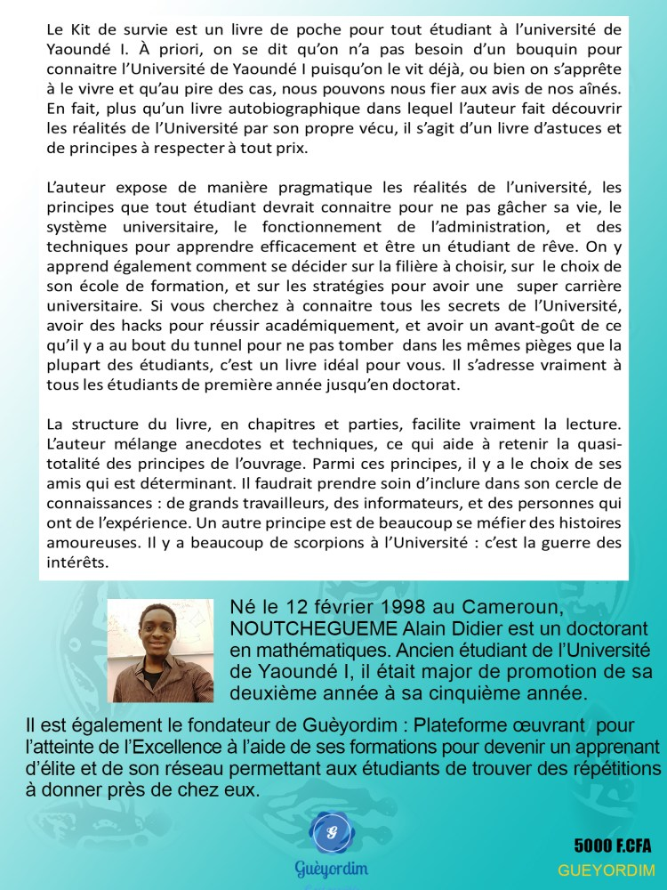

Si tu as suivi la série Scorpion, ou bien n’importe quelle autre série mettant en avant des surdoués et autistes ; alors tu as dû voir que la surdouance est présentée comme l’idée de personnes relativement retirées du monde et ayant des capacités analytiques hors du commun. Certains ont des mémoires photographiques, d’autres sont des encyclopédies vivantes, d’autres encore sont tellement doués en informatique qu’ils ont piraté des systèmes informatiques à 10 ans.

Il y a un peu moins de deux ans, je pensais aussi que les surdoués étaient des génies créatifs qui trouvent toujours tout sans jamais rien chercher.

Il se trouve que j’ai eu la chance de rencontrer et de côtoyer des vrais surdoués : En passant par des Médailles Fields (Prix Nobel en maths), des encyclopédies vivantes, des potentiels analytiques très développés, et des esprits très créatifs. Et tu sais quoi ? C’était très impressionnant, et assez différent de ce qui est présenté par cinéma Hollywoodien. En même temps, on ne peut pas vraiment reprocher au cinéma d’exagérer ou pas certains traits d’une personnalité, et d’occulter certains défauts. Après tout, qui suivrait une série dans laquelle le personnage principal n’arrive même pas à ranger une assiette ?

Viens découvrir avec moi dans cette publication ce que sont les surdoués dans la vraie vie.  
  
Alors, le mythe du surdoué, on en a déjà parlé dans le livre [le Kit de Survie](https://gueyordim.com/livre/)

Si tu es un lecteur fidèle de ce blog, alors tu as déjà probablement le livre. Donc pour ne pas redire les mêmes choses, Je vais aborder cette thématique sous un angle différent dans cette publication.

Déjà, je rappelle qu’il n’y a pas de consensus sur la notion de surdouance. La définition standard est qu’il s’agit des 3% de la population avec le plus grand QI par le test WAIS IV (pas les machins en ligne); ce qui correspond à un QI supérieur à 125.

Alors, 3% de 7 milliards, ça fait quand même 210 millions. Donc il n’y a pas de quoi être jaloux ou bien se vanter, cette population dépasse celle de plusieurs pays. Nous en rencontrons tous des centaines chaque jour.

Par contre, quand on parle des surdoués, on a souvent l’impression que ce sont des petits flocons de neiges rares. Et la raison c’est qu’on parle en général de ceux qui ont réalisé quelque chose. Dans ce monde dicté par le résultat, on ne devient ‘’génie’’ que lorsqu’on est reconnu comme tel.

Ce qui est plus intéressant avec les surdoués, c’est plutôt leur profil psychologique général. Une grande partie des surdoués sont en échec scolaire. Dans les pays occidentaux, ce sont les difficultés liées aux surdoués qui ont fait en sorte qu’il y ait eu création de centres spécialisés pour les surdoués si bien qu’aujourd’hui ce concept est plus un Business qu’autre chose.

Pour le capter, il suffit d’observer le nombre de sites qui font payer pour un test de QI ‘’sérieux’’ : l’idée étant à la fois de réconforter les parents en leur faisant comprendre que leur enfant n’est pas débile, mais seulement trop intelligent ; et les enfants (dit précoces) se réconfortent dans le fait qu’ils ne sont pas bizarres, mais juste différents. Heureusement d’ailleurs que ce système n’est pas encore arrivé chez nous en Afrique car il pourrait facilement pervertir des jeunes talentueux.

Cela dit, ça ne signifie pas en revanche qu’il ne faille pas s’intéresser à ce phénomène.

Les surdoués (ou hauts potentiels ou zèbres) ont la particularité d’avoir une hyper empathie, doublée d’une hypersensibilité, et des comportements parfois irrationnels.

A titre d’exemple, j’ai rencontré l’année passée une fille qui avait un QI de 137. Par le vrai test WAIS IV ; pour autant elle était assez fermée d’esprit et avait beaucoup d’idées préconçues difficiles à attaquer. Par exemple, je n’ai pas pu la convaincre que le dimanche était le premier jour de la semaine juive alors que c'est une information, et non une réflexion.

Bon, il faut aussi dire qu’en effet, en terme de capacité de cognition, les surdoués sont très impressionnants.

Ils sont caractérisés par ce qu’on appelle un **déficit d’inhibition latente** dont une conséquence directe est que pendant que la majorité des personnes réfléchissent de manière linéaire (une idée se connecte à une autre, puis une autre, etc), eux ils réfléchissent en arborescence (une idée se connecte à la fois à plusieurs idées). C’est ce qui les rend si créatifs. Les surdoués ne sont pas quantitativement plus intelligents, ils ont juste une intelligence qualitativement différente (bon c'est aussi vrai tout de même que la vitesse de connexion de neurones est légèrement plus rapide chez eux).

Malgré tout, le concept de la douance est très controversé dans le milieu scientifique. Pour certains, il s’agit d’une idéologie de domination pour certains peuples, question d’asseoir leur domination intellectuelle. Il y a d’ailleurs un article de blog très virulent de Nassim Nicola Taleb sur le sujet, voici le [lien](https://medium.com/incerto/iq-is-largely-a-pseudoscientific-swindle-f131c101ba39). Il démontre que la notion de QI est assez largement pseudo-scientifique, et qu'il pourrait mesurer au mieux une inintelligence extrême en fait. Et c’est là tout le point : au départ, avant d’être utilisé comme un instrument de politique et de marketing, le QI servait à mesurer le niveau de déficience mentale chez les débiles mentaux.

C’est pour cette raison que certains experts adoptent plutôt une approche un peu plus qualitative de la notion de surdoués en prenant en compte la dimension psychologique puisqu’en réalité, le vrai problème se situe au niveau des surdoués qui ont des problèmes d’adaptation au monde.

Pour détecter la douance, cela se fait avec un expert via un test de QI WAIS IV et un bilan psychologique. Cependant, vous pouvez déjà vous faire une idée: Soit en passant ce petit [test](https://www.youtube.com/watch?v=Y0FxJ2BS-Xw) en direct; Soit en lisant quelques livres sur le sujet. Une recommandation pour vous est le livre: "_Trop intelligent pour être heureux_ _?_" de Jeanne Siaud Facchin.

Je vous propose de ne creuser que si vous avez une sensation réelle de décalage et de manque de sens dans votre vie. Autrement, cela ne sert strictement à rien de savoir si oui ou non vous appartenez à un côté d’une certaine courbe.

Pour le reste, vous pouvez regarder dans le livre [le Kit de Survie](https://gueyordim.com/livre/) comment la compréhension de ce concept peut vous aider à avoir de meilleurs résultats universitaires que vous soyez surdoués ou pas.

Excellent week-end à vous.
