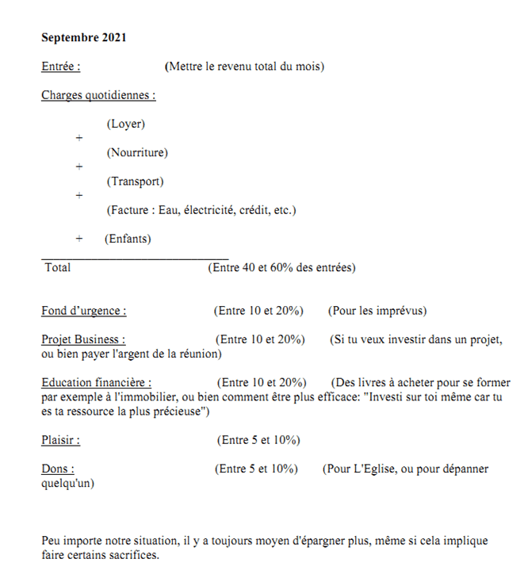

Avez-vous déjà été à court d’argent ? Genre vous n’avez vraiment rien, pas même l’argent de taxi ; et vous vous retrouvez obligé soit de prêter, soit de marcher à pied.

Si c’est votre cas, vous vous dites peut-être que ce n’est pas si grave, après tout vous êtes juste étudiant, et les étudiants n’ont pas d’argent.

Si cette situation arrive assez régulièrement, alors il faut savoir que ça à peu avoir avec le montant que vous recevez, mais plus avec votre manière globale de gérer l’argent.

Le problème si vous continuez sur cette pente, c'est que vous risquez bientôt de vous retrouver comme cet oncle ou cette tante qui lorsqu’il/elle vient chez vos parents, tout le monde sait déjà pourquoi : **Demander l’argent**.

Il ou elle travaille bien, mais est toujours à court et criblé(e) de dettes. C’est en général eux qu’on envoie à la boutique pendant les réunions familiales.

Si vous voulez éviter ce destin funeste, vous avez intérêt à apprendre dès maintenant à mieux gérer votre budget en tant qu’étudiant.

Je ne vais pas vous dire des choses classiques comme : _‘’épargnez de l’argent’’,_ _‘’achetez une caisse’’,_ _etc_. Ceci, vous l’avez déjà entendu mille fois. Et si vous ne le faites tout de même pas, c’est pour une bonne raison.

En revanche, comme d’habitude, on va d’abord essayer de creuser dans nos besoins humains pour comprendre la psychologie de la gestion d’argent, et ensuite proposer un diagnostic complet.

Il se trouve que l’argent est super important dans notre vie. Au-delà de nous permettre d’acquérir des biens pour notre survie, il joue un rôle social ; et même plus : **notre manière de dépenser définit notre identité et vice versa !**

a

**I. Votre manière de gérer l’argent en dit bien plus sur vous que vous ne le pensez**

On a demandé un jour à Bill Gates en interview : _**‘’Quelle est votre plus grande peur dans la vie Monsieur Gates’’.**_ Au-delà des attentes, au lieu de répondre _**‘’Devenir pauvre’’,**_ Gates a répondu : **_‘’Je ne veux pas que mon cerveau s’arrête de fonctionner’’._**

Ceci peut ressembler à une information random, mais ça nous permet un peu mieux de comprendre la psychologie de cet homme, et nous donne beaucoup d'informations sur la manière dont il dépense son argent. Dans ses communications, il parle plus des **livres qu’il achète, lit et écrit** ; que de jets ou de grosses voitures.

**_Notre manière de dépenser de l’argent nous renseigne à la fois sur la manière dont nous voulons que les autres nous voient, ainsi que sur la manière dont nous nous voyons nous même._**

Quelqu’un par exemple qui portera des habits chics et swagg veut que les gens le voient comme un gars "chaud", et lui-même se voit comme un gars "chaud". Du coup, il mettra le prix sur la table et dira qu’il est à l’aise lorsqu’il s’habille bien. En revanche, si pour vous être "chaud" n’est pas si important, alors vous achèterez juste les habits les moins chers que vous trouverez à Mokolo.

De même, quelqu’un qui donnera de l’argent aux œuvres de charité pense que c’est une bonne chose et se verra quelque part comme quelqu’un de consciencieux.

Ceci va dans les deux sens : _**Non seulement la manière dont nous nous voyons influence nos décisions d’achats, mais aussi notre manière de dépenser notre argent nous aide à façonner notre identité en indiquant ce qui est important pour nous.**_

C’est pour cela qu’il y a beaucoup de personnes qui veulent se voir comme des amoureux de l’apprentissage : ils téléchargent pleins de livres gratuitement sur divers sujets, mais ne les lise jamais.

Par contre, lorsque ces mêmes personnes finissent par sortir réellement de l’argent de leur poche pour acheter des livres, ils finissent par effectivement lire ces livres et apprendre. Ceci c’est parce que par leur décision d’achat, ils impriment dans leur esprit le fait qu’ils sont vraiment des lecteurs et que l’apprentissage est vraiment important pour eux : tellement qu’ils sont prêts à y mettre le prix.

Ce qui est plus important ici, c’est bien moins l’action en cause en elle-même que l'intention derrière de cette action : **_Nos intentions d’achats façonnent notre identité qui en retour guide nos achats_**. En bref, on achète que ce qui est important pour nous.

Une fois que ceci est dit, on comprend que pour modifier déjà notre manière de gérer notre argent, **il faut modifier la manière dont on se voit soit même et dont on veut que les autres nous voit.**

Sans cela, c’est peine perdue. Peu importe la somme d’argent que vous gagnerez, si vous voulez que les autres vous voient comme quelqu’un de riche et dépensez au-delà de vos moyens dans les signes extérieurs de richesse (iPhone, Voiture inutilement couteuse, Snack bar, Shawarma, etc.), alors vous serez toujours comme une passoire qui laisse filer tout ce qui y entre.

Mais si vous lisez cet article, je vais supposer que ce n’est pas votre cas.

Une fois que votre manière de vous voir est claire, pour gérer votre argent… Il vous faut en avoir.

Si vous dépendez financièrement uniquement de vos parents, il peut être une bonne idée de chercher à gagner aussi de l’argent par vous-même en parallèle.

**II. Gagner de l’argent**

1. **Les excuses des étudiants pour ne pas avoir d’activité génératrice de revenu**

Quand on est encore étudiants et à la charge des parents, il y a un certain nombre d’arguments qui mènent à ne pas avoir d’activité génératrice de revenus. Je vais essayer d’énoncer les plus fréquentes et essayer d’expliquer pourquoi selon moi, ces raisons ne sont pas pertinentes.

- **Excuse 1** : _L’école prend beaucoup de temps._

Alors, si on me l’avait sorti au lycée, peut-être à la limite j’aurais compris vu que les cours sont de 8h à 16h.  
Mais à l’Université, dans certaines filières il n’y a dans une semaine qu’un cours de 3h par jour. Même si on dit que les cours sont plus denses et prennent plus de temps à étudier qu'au lycée, la réalité c’est que la plupart de notre temps est parasité par : _**des discussions non constructives**_ et _**des activités bouffe temps**_.

Une étude a mis en exergue le fait que _**le temps de travail intellectuel effectif dans une journée est limitée à 4h**_ : la plupart du reste du temps n’apporte pas tant de valeur que ça.  
  
Du coup, le reste de la journée peut tranquillement être consacrée à des activités peut être un peu moins cognitives, mais génératrice de revenu.

- **Excuse 2 :** _On prépare les concours._

Ceci également dépend de la manière de gérer ses activités et son énergie. Il est tout à fait possible d’être à l’université, de préparer ses concours en étant excellent partout, et de gagner assez d’argent pour alléger la charge familiale. J’ai un ami qui l’a fait et qui dormait toujours normalement et appréciait la vie.

- **Excuse 3** : _Le travail des étudiants est d’étudier._

Peut-être bien. On dit qu’en cherchant à poursuivre deux lièvres à la fois, on n’en attrape aucun. Sur ceci, on est tous d’accord.  
  
En revanche, on peut suivre deux lièvres à la suite (l’un après l’autre alternativement), et il s’avère que c’est même plus efficace.  
  
Si vous n’avez que vos études à faire, même si vous manquez un jour de cours, ce n’est pas grave parce que vous vous rattraperez demain.  
  
En revanche, si vous avez plusieurs activités à gérer, alors à chaque bloc de travail vous vous assurerez d’être le plus efficace possible : parce que si vous en manquez un, vous n’aurez plus la chance de vous rattraper pour la journée.

- **Excuse 4 :** _On gagnera de l’argent quand on sera plus âgé._

C’est facile de penser qu’on est assez jeune, jusqu’à ce qu’on entre dans la vie active sans expérience du travail. Cela peut être difficile et frustrant de ne pas avoir d’expérience.  
  
Dire qu’on est assez jeune pour se permettre de ne pas apprendre des difficultés du monde du travail c’est en fait de la procrastination déguisée. On remet à plus tard la confrontation au monde difficile jusqu’à ce qu’il soit trop tard.

a

Vous vous dites peut-être que si même avec votre temps actuel vous êtes toujours à la ramasse dans les cours, alors en ajoutant une autre activité, ce sera pire; mais non ! Si vous vous y mettez, vous vous rendrez compte que beaucoup de choses que vous faisiez dans votre travail personnel vous prenait trop de temps et pourrait être optimisé.

**2\. Comment gagner de l’argent**

La base pour gagner de l’argent est simple : **résolvez un problème dont quelqu’un est prêt à payer pour.**

Maintenant, il y a en gros trois manières de le faire : Soit vous travaillez pour quelqu’un et résolvez un gros de ses problèmes (vous êtes en gros un salarié); Soit vous résolvez directement des problèmes pour plusieurs personnes et ils vous payent en retour (vous êtes entrepreneur); Soit vous donner de l’argent à quelqu’un pour qu’il entreprenne et vous touchez une partie sur ses bénéfices (vous êtes investisseur).

Lorsque vous êtes étudiants, les deux premières possibilités vous ouvrent des perspectives accessibles :

- **Salariat :** Vous pouvez travailler à temps partiel pour des compagnies (en général de téléphonie) qui ont besoin de personnes pour vendre leurs produits (renseignez vous à gauche à droite) ; Vous pouvez aussi travailler pour un parent en donnant des répétitions à leurs enfants (si vous cherchez à donner des répétitions à Yaoundé, écrivez nous à [gueyordim2020@gmail.com](mailto:gueyordim2020@gmail.com)) ; Vous pouvez aussi identifier vos compétences propres (montage vidéo, musique, etc.) et travailler en freelance avec des contrats à plus ou moins long terme.
- **Entreprenariat :** Identifiez les problèmes autour de vous et apportez des solutions au grand nombre. Par exemple, créez un groupe de répétition ; ou bien vendez de la nourriture, ou des fournitures scolaires, ou des appareils électroniques, etc.
- **Investisseurs :** Si vous avez assez de capital, vous pouvez par exemple acheter un taxi ou une moto, la laisser à un travailleur de confiance pour qu’il fasse tourner l’engin et vous rapporte des dividendes.

Soyez créatifs, écoutez de quoi les gens se plaignent au quotidien : développez des solutions et vendez-les ; ou bien identifier des tendances futures qui peuvent être rentables.

**III. Comment gérer son budget étudiant**

Il y a plusieurs écoles dans ce sens. Je vais m’inspirer de la méthodologie de la vidéo que je considère comme la meilleure de la chaine YouTube : Investir au pays. Pour voir la vidéo, voici le [lien](https://www.youtube.com/watch?v=d5j2MUbybG4).

Voici la [feuille](https://mailchi.mp/ff25cf54e3f0/feuille-de-budget) que vous devez remplir en gros (Je vous demande juste votre adresse mail pour vous donner la version Pdf, mais vous pouvez aussi faire un Screenshot si vous voulez).

- 
    

Pour gérer votre budget une fois que vous avez une source de revenu assez stable, vous devez :

1. **Tracer vos dépenses.**

Vous devez avoir une idée très claire d’où va précisément votre argent. Pour se faire, à la fin de chaque journée, vous allez noter sur un carnet ce que vous avez dépensé.

C’est un exercice extrêmement puissant qui vous révèlera vos dépenses, et donc votre identité.

Vous serez surement choqués de savoir que votre argent va dans des achats que vous ne soupçonnez même pas.

Une fois que vous avez une visibilité sur votre argent et que vous avez repris le contrôle sur vos dépenses, vous allez déterminer clairement dans quels postes doivent aller votre argent.

**2\. Charges quotidiennes**

C’est tout ce qui est : loyer, facture (si vous vivez seul), internet, nourriture, transport, etc.

Entre 40 et 60% du budget doit y être consacré. Au-delà, ce n’est pas bon, et il faut faire des efforts.

C’est vrai, ça peut être difficile à cause de la pression sociale : si vous payer un loyer trop cher par exemple, régresser peut paraitre humiliant et être une épreuve sociale trop difficile et douloureuse. Mais cela peut être salutaire pour vous, n'oubliez pas que c'est passager; une fois que vous augmenterez vous revenus, vous pourrez bien entendu augmenter en conséquence votre niveau de vie.

N’oubliez pas votre identité : qui vous voulez être, et dépensez votre argent comme ce style de personnes.

**3\. Fond d’urgence**

On ne sait pas quand des gros imprévus surviennent. C’est pour cela qu’il faut avoir un fond pour cela. C’est ce qui ressemble le plus à une épargne. Mettez de l’argent dans ce poste pour prévoir les intempéries.

Consacrez entre 10 et 20% du budget à ce poste.

**4\. Pour vos projets Business**

Si vous voulez lancer des Business ou bien grossir ceux que vous avez déjà, à un moment ou un autre, la question du financement va apparaitre. Il vous faut de l’argent de côté.

Consacrez entre 10 et 20% de votre budget à ce poste.

**5\. Développement de vos compétences**

Vous avez déjà à l’heure actuelle des réponses à toutes les questions que vous pouvez vous poser : Quelle formation dois-je suivre ? Que dois je faire de mes journées ? Pourquoi y a-t-il des guerres dans le monde ? etc.

Notre cerveau ne peut s’empêcher de coller des réponses à des questions. Le problème c’est que nos réponses intuitives sont très souvent erronées. Mais on n’en a pas conscience la plupart du temps. C’est pour cela que la question d’apprendre de nouvelles choses semble facultative et peu importante. A la limite, on se dit que toute information que l’on veut est disponible gratuitement sur internet. C’est une erreur !

Moi aussi, j’ai pensé que des livres numériques avaient la même valeur que des livres physiques sauf qu’en plus ils sont gratuits ; et la conséquence c’est que je n’en finissais aucun, et je ne développais pas forcément de compétences.

Acheter un livre physique a une puissance d’implication qui donne un caractère personnel à votre effort et montre que vous êtes impliqués.

Une idée de Business en elle-même ne vaut pas grand-chose quelle qu’elle soit. Si vous ne développez pas une compétence rare, vous vous ferez copier et peut-être même dépasser. Ceux qui sont médiocres mais ont un pouvoir dans ce cas vont chercher à bloquer leurs concurrents plutôt que d’améliorer la qualité de leurs services, et si vous n’avez pas un élément de démarcation clair, vous serez éjectés.

Mais pour développer une compétence rare, il vous faut apprendre sérieusement. Et tant que pour vous apprendre n’est pas une nécessité vitale, vous la mettrez toujours en second plan et n’évoluerez pas. Vous devez investir de l’argent dans votre éducation propre si vous voulez vous démarquer.

Consacrer entre 10 et 20% de votre budget est raisonnable.

**6\. Plaisirs**

Pour ceux qui veulent se détendre, vous pouvez avoir entre 5 et 10% de votre budget consacré au plaisir.

**7\. Dons**

Il y a plus de plaisir à donner qu’à recevoir : donner un argent gagné durement vous permet de réaliser que vous en tant qu’être humain, pouvez avoir un impact direct et positif sur la vie des autres.

Consacrez entre 5 et 10% de votre revenu à ce poste.

a

Si tu as trouvé le contenu de cette publication pertinente, alors tu as tout intérêt à t’inscrire à la [newsletter](https://mailchi.mp/dcd3b580d01e/conseils-productivit) pour recevoir des conseils bien plus profonds.

Excellente journée.

Alain Didier.
