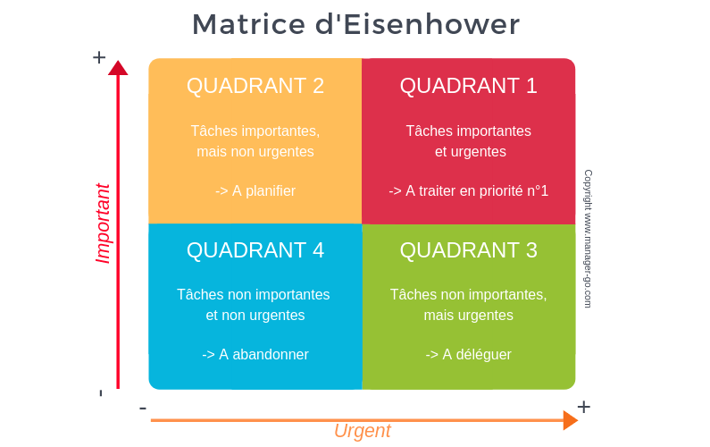

Je vois parfois des étudiants qui s’entêtent à faire encore et encore les mêmes choses.

Les résultats ne sont pas là, mais ils continuent jusqu’à épuisement.

De temps en temps, on me dit : _‘’J’aimerais bien faire ceci, mais je suis déjà débordé’’._ Ils accumulent des tâches _‘’à faire’’,_ mais font tout sauf lesdites tâches. C’est paradoxal : Pourquoi plus il y a de choses qu’on _‘’doit faire’’,_ moins les choses sont faites ?

C’est clair qu’il faille changer quelque chose. Mais quoi ?

La sagesse populaire nous donne des éléments de bon sens pour avoir de bons résultats : _avoir plus de volonté_, _être plus discipliné_, _être plus organisé_, _travailler au jour le jour_, etc.

C’est facile à dire, mais c’est un calvaire à suivre pour une catégorie de personnes : tout le monde ne nait malheureusement pas génie de l’organisation.

Seulement, il existe un chemin tout autre pour parvenir à faire les choses efficacement et ne plus être débordé lorsqu’on est de ceux-là qui ont deux mains gauches et qui sont bordéliques par essence.

Si vous voulez vraiment augmenter la quantité de tâches que vous effectuez réellement, vous devez comprendre les bases du travail efficace et de pourquoi nous procrastinons. Autrement, à chaque fois que vous serez un peu motivés, vous vous sentirez comme au toit du monde : capable de tout réaliser, vous ajouterez encore et encore des choses à faire ; sur le coup, vous ferez plus que d’habitude, suivi par deux semaines de jachères…

Quand tout va bien, on s'imagine que c'est l'état normal des choses. Pourtant la motivation elle aussi obéît à un cycle: c'est normal d'être super motivé pendant une période, et de ne plus vouloir rien faire pendant une autre. Ce n'est pas rentable de compter sur la motivation pour achever plus de choses.

Essayons de faire ensemble un calcul simple: Si depuis des années les choses ont été comme ça (up and down de motivation), il n’y a pas vraiment de raison que ça change aujourd’hui: à moins qu’un re framing total ne soit fait.

La réponse est loin de la sagesse populaire… Mais elle fonctionne (la preuve vivante est celui qui écrit cet article).

J’ai découvert ces concepts alors que je cherchais de base des réponses pour moi. J’ai lu tous les livres, j’ai suivi toutes les formations et tous les séminaires de productivité. J’ai testé toutes les techniques et les ai fait tester à d’autres. Ça a marché, et maintenant j’enseigne au grand public ce qui marche vraiment en fonction de chaque profil.

Vous pouvez vous inscrire à la [Newsletter](https://mailchi.mp/043d8982459e/gueyordimnewsletter) pour avoir le meilleur de tout ce que je propose.  

Il y a des pièges à éviter absolument si vous voulez vraiment sortir de cette spirale où vous espérez chaque jour que ‘’demain sera meilleur’’.

Aujourd’hui, j’aimerais qu’on étudie la question : _**Comment ne plus avoir la sensation d'être débordé, et actuellement achever plus de choses ?**_

Les trois idées principales c’est que si vous voulez éviter la surcharge, vous devez : _**filtrer les tâches à faire**_, **_vous concentrer sur le processus et non sur les résultat_**s, et _**vous ne devez pas culpabiliser de prendre des pauses**_.

1. **Les filtres**

Si vous voulez faire plus de choses, vous devez accepter moins de tâches.

Vous êtes vous déjà posé la question du nombre de tâches que vous acceptez de faire par jour ?

_‘’Je vais cuisiner’’,_ _‘’Je vais aller à l’orphelinat’’,_ _‘’Je vais rendre visite à Richard’’,_ _‘’Je vais coudre mon habit’’,_ _‘’Je vais lire ceci’’,_ _‘’Je vais faire tels exercices’’,_ etc.

On ne questionne pas souvent pourquoi on fait telle ou telle tâche, ou bien si réaliser cette tâche a vraiment de la valeur.

Lorsqu’une nouvelle tâche vous est proposée ou vient dans votre esprit, la réponse par défaut ne doit pas être **_‘’oui’’_** à la tâche. La réponse par défaut doit être _**‘’non’’.**_ Parcequ'en général, une nouvelle tâche va venir vous déconcentrer de vos objectifs principaux.

Pour qu’une tâche mérite d’être faites, elle doit passer plusieurs filtres. Et si elle ne passe pas, cela signifie que c’est une distraction et qu’il faille la supprimer ou la reporter à plus tard.

Dans l’univers de la productivité, il existe plusieurs types de filtres de décisions. Le plus célèbre c’est la matrice d’Eisenhower.

Le problème c’est qu’elle en général mal utilisée (ou pas du tout). Personnellement, je n’utilise pas la matrice d’Eisenhower car j’ai un autre filtre qui me convient mieux, mais la matrice d’Eisenhower peut être efficace si elle est utilisée correctement.

Au cas où vous ne connaitriez pas, la matrice d’Eisenhower est un cadrant comme celui-ci :

Si vous voulez comprendre mieux la matrice d’Eisenhower, cherchez-le sur google ; et ce dernier vous servira gracieusement sur un plateau des milliers de pages web et vidéos YouTube à propos.

Ce qu’il faut juste retenir, c’est que lorsqu’une tâche arrive, la question à vous poser est : dans quelle case est cette tâche ? Et vous agissez en conséquence.

L’erreur commise la plupart du temps est de classer dans les cases importantes ce que vous aimeriez faire un jour.

La vérité c’est qu’on n’a en général pas conscience de ce qui est vraiment important pour nous. La plupart du temps, nous faisons les choses car il ‘’faut les faire’’.

Ce qui est vraiment profondément important pour nous est en général hostile au monde extérieur. Car c’est plutôt ce qui est directement raccroché à **nos valeurs**, et à **notre idéal de vie**. Le problème… C’est que pour ce qui est vraiment important pour nous (et pas pour la société), on n'impose en général pas de deadline.

Nous Voulons bien apprendre l’anglais mais… Il n’y a pas de temps pour cela : _**‘’Je le ferais pendant les vacances’’**._ Nous voulons bien lire un livre sur l’économie et comprendre l'écosystème géostratégique, mais… Nous sommes déjà trop débordé, **_‘’Comment ajouter autre chose ?’’._** Nous voulons bien lire ce cours mais… Nous sommes trop fatigués : _**‘’Demain sera mieux’’.**_

Actuellement, les tâches qu’il faut faire en permanence, ce sont celles qui sont importantes, mais non urgentes. Parce que 99% des tâches urgentes sont celles qui n’étaient pas urgentes hier, mais que vous avez repoussé.

A la limite, les tâches importantes qui ont une deadline qui vous est imposée par votre école seront faites tôt ou tard (tard en général).

Par contre, les tâches importantes pour votre idéal de vie propre, et qui en réalité vous différencient de ceux qui suivent la même formation que vous (comme par exemple développer votre anglais, ou apprendre une nouvelle compétence, etc) ne seront jamais faites tout court si vous ne rendez pas conscient le fait qu’elles sont vraiment importantes et même indispensables pour vous.

**2\. Concentrez-vous sur le processus**

Ceux qui réussissent et ceux qui échouent ont le même objectif : **Gagner**. La différence n’est dont pas au niveau des objectifs, mais ailleurs.

Les objectifs sont juste une direction à prendre, mais une fois qu’ils ont été fixés, pas besoin de revenir dessus trente mille fois. Ce sur quoi il faut se concentrer en priorité, c’est le processus de travail qui vous mènera au résultat, et non le nombres de pages qu’il reste à lire. Au pire, si vous n’avez pas fini, ce n’est pas grave, demain vous continuerez.

La clé du travail bien fait sur le long terme c’est de ne pas sentir la difficulté.

On a grandi avec le mensonge : travailler ou s’épanouir, il faut choisir. C’est une des raisons pour lesquelles tant de personnes attendent le weekend avec impatience. Pour moi aujourd’hui, il n’y a pas vraiment de différence entre le weekend et la semaine : mon travail et mes études sont comme un jeu vidéo, je n’ai aucune raison de vouloir que ça s’arrête.

Je peux vous assurer que ce style de vie est non seulement possible, mais très gratifiant. Et pour y arriver, une des clés est d’oublier les objectifs et d’apprécier le processus.

A moins que vous ne soyez passionné par le travail sous stress, vivre en ne pensant qu’à vos objectifs c’est le meilleur moyen d’être anxieux en permanence. Ça, c’est comme le disent les américains la hustle culture : ‘’Je dois faire ceci, je dois faire cela, je dois, je dois…’’.

Vous pouvez atteindre les résultats de cette manière, mais au prix d’un coup de qualité de vie énorme. Et une fois l’objectif atteint, il vous faudra un autre objectif plus haut, et encore et encore. C’est comme une roue de hamster.

Alors qu’en vous focalisant sur le processus plutôt, vous pourrez avoir le luxe d’apprécier ce que vous faites ; et de plus, vous pouvez avoir le recul qu’il faut pour savoir si vous allez dans la bonne direction ou bien si vous avez besoin d’aide.

**3\. Ne pas culpabiliser de se reposer**

C’est impossible d’être productif H24 à moins d’être dans un établissement militaire avec plein de gens autour.

L’idée de l’humain augmenté qui peut charbonner du matin au soir est encore uniquement dans le monde de la fiction.

Dans la réalité, les moments de fatigues sont les bons moments pour se reposer.

De toute façon, même si vous le voulez, vous ne pouvez pas être productif dans les moments de down énergétique.

Donc plutôt que de forcer à des moments de la journée où vous devriez vous reposer, c’est mieux d’utiliser votre fatigue naturelle pour vous reposer ou bien effectuer des tâches importantes et non urgentes de type différent que d’habitude (comme apprendre l’anglais ou lire un livre de non-fiction). L'une des premières choses que j'enseigne à ceux qui viennent me voir pour être plus efficace, c'est comment repérer ces moments naturels de montée et baisse énergique car c'est l'une des bases du travail efficace non contraignant.

Ce n’est pas raisonnable de culpabiliser de ne pas être entrain de bosser à des heures où vous ne le pouvez même pas en fait.

Si cette publication vous a parlé, n’hésitez pas à la partager à quelqu’un qui aurait besoin d’entendre ce message.

Bon weekend,

Alain Didier.
