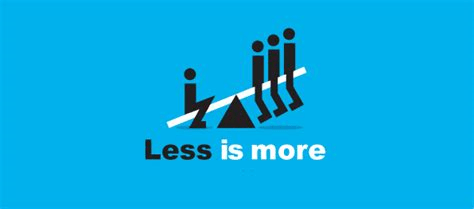

Souvenez vous des dernières fois où vous étiez à la veille de la deadline pour la remise d'un projet, ou bien la veille d'un examen. Oui, souvenez vous bien, lorsque vous étiez stressés, mais dans un état de concentration maximale.

Maintenant, imaginez que je vous dise qu'il est possible de recréer au quotidien les conditions du flow (c'est le nom de cet état dans le jargon de la productivité). Il y a en réalité 6 éléments qui entrent en ligne de compte dans le déclenchement de cet état. Je ne vous en présenterais qu'un seul dans cette publication, je présente en général les autres lorsque j'accompagne des gens.

Cependant, vous verrez que cette clé à elle seule représente une nouvelle manière de vivre qui permet de faire plus. Je l'appelle **le théorème fondamental de la productivité**.  
  
En mathématique, à chaque fois qu'on écrit un théorème, il faut écrire les hypothèses du théorème. C'est vrai que quand on parle du théorème de Pythagore, les gens retiennent juste la formule c²=a²+b² parce que c'est plus facile. Mais en réalité, les hypothèses sont aussi importantes que la conclusion. En l'occurrence, si on retire dans le théorème de Pythagore l'hypothèse que le triangle est rectangle, alors la conclusion de ce théorème n'est plus valide.

Le théorème fondamental de la productivité ("-=+") a aussi ses hypothèses. Elles sont assez nombreuses, donc je ne peux pas toutes les détailler ici (un exemple d'hypothèse est qui n'y ait pas de choses extrêmement urgente à faire; un autre est qu'il faille être dans un état émotionnel soit relativement stable, soit orienté frustration).

Nous voulons plutôt nous concentrer sur la conclusion de ce théorème qui serait en fait qu'on est productif si et seulement si on fait moins de choses.

**Moins c'est plus**, ou bien **Less is more**.

<figure>

<figcaption>

creativ.com.au

</figcaption>

</figure>

En réalité, ce théorème dit que pour faire plus de choses, il faut et il suffit de vouloir faire moins de choses.

Pour dire qu'en réalité, on fait toujours une seule chose à la fois, donc pour être plus productif, l'idéal serait de ne faire qu'une seule chose spécifique dans une journée.  
C'est le principe des chaines de production asiatique: tu as une personne dont le seule travail est de taper une barre de fer avec un marteau, un autre tire juste une barre de fer, un autre découpe, un autre lime. A la fin de la journée, ils ont produit 10000 aiguilles. Par contre, tu prends 100 personnes qui font toutes les étapes, et produisent chacun des aiguilles, et à la fin de la journée tu as 1000 épingles.

Nous n'allons pas présenter la preuve de ce théorème (Les démonstrations apparaissent dans les recherches scientifiques de manière empirique, bien qu'évidemment ces résultats ne sont pas présentés sous forme de théorème, haha). Par contre, nous allons prendre quelques exemples spécifiques dans le cadre scolaire pour mieux comprendre ce que dit ce théorème.

Reprenons d'abord le cas de la deadline pour l'exposé: Dans ce cas, vous n'avez qu'une seule chose en tête: vous avez supprimé de votre esprit toute autre idée (pas de télé, pas de réseaux sociaux, pas d'autre cours). J'ai même d'ailleurs vu des gens s'absenter dans d'autres cours parce qu'ils voulaient terminer leur exposé à temps. Tout ce qui compte désormais, c'est votre projet, et votre projet seul. Et c'est justement le fait de supprimer tous ces composants parasites qui vous permet d'être aussi productif.

Je vais prendre un deuxième exemple: Lorsque vous êtes avec des amis et que vous discutez d'un sujet qui vous passionne (le Flow n'est pas seulement dans les études en passant). Alors, vous êtes complètement concentrés sur ce que vous faites, et êtes productifs là dedans (même si c'est être productif dans le nkongossa, hahaha).

Un dernier exemple pour la route c'est lorsque vous êtes en classe et où tout ce que vous avez à faire c'est de suivre le cours jusqu'à ce que la cloche sonne.

En réalité, dans le cas où il n'y a pas de pression due à la deadline, il y a trois dimensions de sa personne qu'il est fondamental de prendre en compte pour pouvoir mettre ce théorème en application dans votre vie.

La première dimension, c'est l'exécutant, ou bien le salarié pour utiliser un jargon d'entreprise. C'est celui qui exécute les tâches de manière opérationnelle pour qu'elles soient faites: par exemple lire le cours de Microbiologie, faire la vaisselle, etc. L'Ultra grande majorité des étudiants se confinent dans cette position, et c'est ce qui les empêche de réaliser plus.

La deuxième dimension, c'est le divertissement, ou la détente. Mais oui, lorsqu'on ne travaille pas, alors on se diverti/détend. Ceci c'est soit lorsqu'on dort, soit lorsqu'on est avec des amis, ou entrain de regarder un film, etc.

Il y a une troisième dimension tout aussi voir plus importante que les deux autres c'est celle du dirigeant, ou bien le manager. C'est celui qui planifie, qui choisi les actions à prendre en priorité, etc. Beaucoup d'étudiants que j'accompagne ont une place de Manager quasi inexistante. Ils cherchent à déterminer pendant qu'ils étudient quel cours ils devraient lire en premier, quelle partie du cours lire, cours ou bien exercices, etc.

Du coup, ils s'éparpillent car ils sont entrain de réfléchir à la fois sur ce qu'ils devraient faire et sur ce qu'ils font. La place de planification est centrale dans la théorie de la productivité.

Il ne s'agit pas de faire un emploi du temps une fois et c'est parti pour la vie. NON!  
Le rôle de l'organisation est permanent et dynamique à chaque fois, il faut décider de supprimer des activités pour ne se concentrer que sur ce qui est vraiment essentiel, et donc être plus productifs par le théorème fondamental de la productivité.

Développez ce Manager en vous, accordez vous au moins 1h à la fin de chaque semaine pour planifier des choses pour la semaine; et au moins 10 min chaque soir pour planifier le lendemain et vous verrez que vous accomplirez plus de choses.

Si cette publication t'a intéressé, alors je te conseille de t'inscrire sur la [liste email](https://mailchi.mp/dcd3b580d01e/conseils-productivit) pour avoir des conseils encore plus profond.

Excellente fin de semaine à toi.
