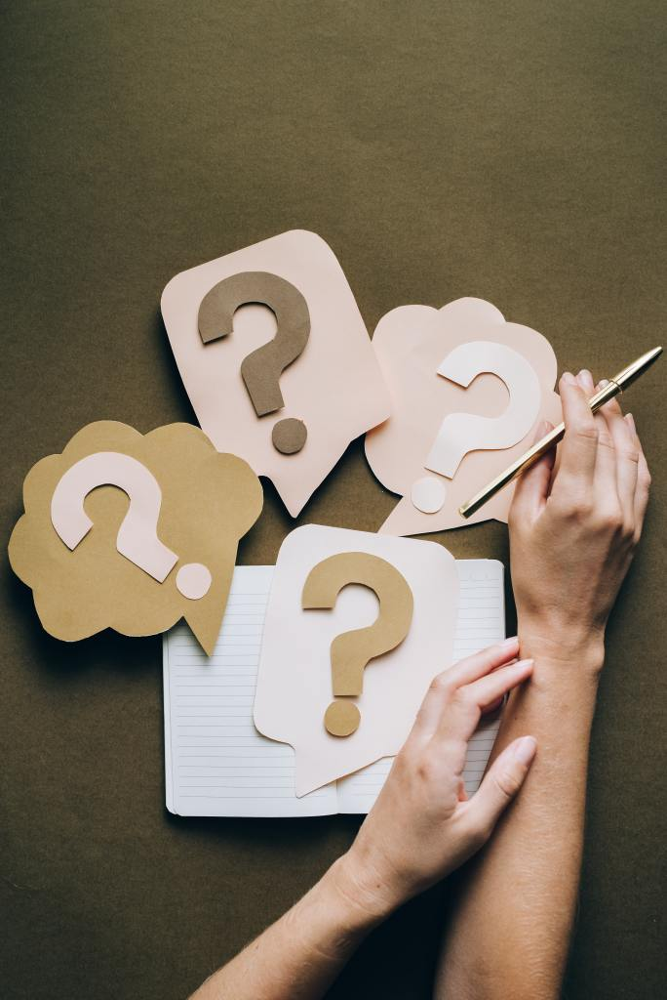

a

Ces 4 questions simples peuvent sauver vos examens.

On connait tous cette sensation lorsqu’on étudie pour un examen de ne pas trop savoir ce qui va venir, de ne pas trop savoir si on investi notre temps dans la bonne UE, et s’il ne faut pas passer à un autre discipline.

C’est la question de savoir si on est suffisamment prêt pour une UE pour peut se permettre de la mettre de côté et en apprendre une autre.

Il y a plusieurs manière de gérer cette situation: La première c’est d’évoluer un peu à l’aveugle et d’étudier au feeling jusqu’à ce qu’on tombe sur des notions qu'on ne maitrise pas. Là, on peut se dire que « ça ne va pas venir de toute façon »; et passer à une autre UE.

La deuxième façon de gérer cette situation c’est de se définir un filtre de préparation pour savoir si on est suffisamment prêt pour passer à autre chose, et éclaircir ce qui est encore floue.

Si tu as vu le film Harry Potter 3, la méthode que je te propose ressemble à celle du professeur Lupin (Le Loup-Garou) pour permettre aux étudiants de vaincre leurs peurs cachées.

La première étape est de faire prendre conscience aux étudiants de leur peur cachée. La deuxième étape est de leur faire matérialiser cette peur là. La troisième étape est de leur faire voir leur peur dans les yeux jusqu’à ce qu’ils n’en aient plus peur. Et la quatrième étape est d’utiliser le sort « Ridiculus » pour rendre leur peur absurde.

En suivant la même pédagogie, voici les 4 questions à se poser:

''  Est-ce que je fournis un effort colossal pour comprendre cette notion ?  
 Est-ce que je participe activement aux discussions entre camarades ?  
 Est-ce que je comprends tous les fax ? Ou bien: Est-ce que je peux traiter rapidement tous les exercices de ma fiche de Td avec mes yeux (du moins avoir les grandes idées)?  
 Ai-je une autre séance d’apprentissage avant l’examen ? '' Extrait du [Kit](https://gueyordim.com/livre/) P.158.

Félicitations si vous avez lu cet article jusqu’à la fin.

Si vous avez le temps, pensez à le partager pour aider un ami; cela m'aiderais grandement et me permettrai de toucher un plus grand nombre.

A demain.
