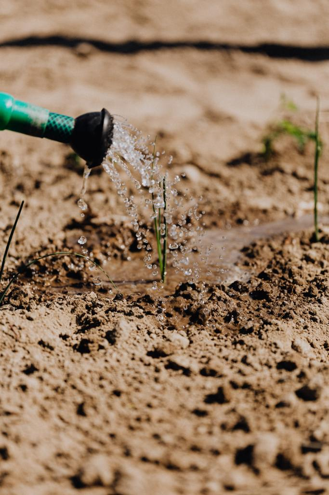

On dit chez nous qu’on n’a pas besoin de creuser profondément pour reconnaitre la bonne terre. Cependant, si on veut beaucoup récolter, il faut beaucoup semer, et donc beaucoup creuser peu importe la qualité de la terre.

Je vais conserver cette analogie avec la terre pour toute cette publication car selon moi, se conforter à ses ‘’capacités’’ héritées sans les travailler c’est exactement comme être fier de ses matières premières sans les transformer.

Dans cette publication, nous verrons le piège et les limites des prédispositions naturelles. Ensuite, on verra quelques solutions pour pouvoir cultiver effectivement sa terre.

Cette publication s’adresse uniquement à ceux qui ont déjà entendu dire qu’ils sont doués dans un domaine quelconque particulier, et qui ont l'impression de ne rien faire au quotidien (ou pas assez) pour mettre en valeur ces talents.

Alors, je disais qu’il faut qu’on parle de l’arnaque du talent. Mais avant, il y a quelque chose de fondamental à comprendre dans les recherches sur ‘’l’intelligence’’. J’avais promis de parler de ce sujet un jour, il y aura une publication dédiée ça vient. Entre temps, voici une [série de vidéos](https://www.youtube.com/watch?v=hZejJ8qHnmw&list=PLuM_FOFR0-2R23SeBO7og22Vp5SmwWrRb) fiables sur débuter avec ce sujet.

Une chose importante à comprendre, c’est qu’à peu près 49% de notre niveau intellectuel est expliqué par la génétique, et 51% est expliqué par l’environnement. Pour pouvoir séparer ces effets, les chercheurs ont en fait étudié les développements intellectuels de deux vrais jumeaux séparés à la naissance. Vrais jumeaux signifie qu’ils ont EXACTEMENT le même patrimoine génétique.

Ce qu’on appelle le talent c’est en fait la partie expliquée par la génétique. On peut dire que cette partie est gratuite. Ou pour continuer avec l’analogie des terres : c’est comme les terres qui ne sont pas dotées pareillement en potentiel agricole et minier.

C’est justement parce que cette partie est gratuite qu’elle ne vaut rien.

Pour tout ce qui est élémentaire comme jouer au foot dans son quartier ou bien dessiner à la maison ou bien chanter dans sa cuisine, le talent peut être utile. En revanche, pour des œuvres vraiment impactantes, de grandes augures et internationales, son effet commence à être marginal.

Je m’en suis rendu compte pour la première fois au début de mon doctorat. C’est facile de penser au début que ça va être comme d’habitude, que peut-être les prédispositions naturelles suffiront une fois de plus. Mais quand la réalité te rattrape, ça fait mal.

Quand tu te rends compte que pour être compétitif, il faut : de la persévérance, une meilleure gestion de son énergie, une gestion de sa stabilité mentale, un travail plus acharné sans forcément de résultats probants, développer plein d’autres skills pour potentiellement avoir une bonne place sur le marché de l’emploi ; et que tu découvres que ce que tu croyais être du talent ne te sauvera pas une fois de plus, tu tombes de haut.

J’écoutais encore dernièrement l’histoire d’un ancien major qui est presque devenu fou.

Evidemment, je ne vous dis pas tout cela pour vous faire peur. Je veux juste vous inviter à développer vos 51% restants car vous pouvez avoir une influence dessus : vous pouvez avoir le contrôle de vos activités, vous pouvez choisir vos habitudes, et vous pouvez développer de votre méthodologie.

C’est aussi pour cela que ces publications existent. Pour qu’ensemble, on développe nos Soft Skills et qu’on ait beaucoup plus de valeur à apporter que d’être champion en 4ème division. Je rappelle le lien pour s'inscrire à la [Newsletter](https://mailchi.mp/dcd3b580d01e/conseils-productivit) dans laquelle le contenu est plus pointu qu'ici.

Ce qui est encore étrange est qu’en cultivant vos talents, de nouveaux émergeront ; en revanche, si vous enterrez ceux-ci, ils finiront par disparaitre.

Excellente journée à vous.
