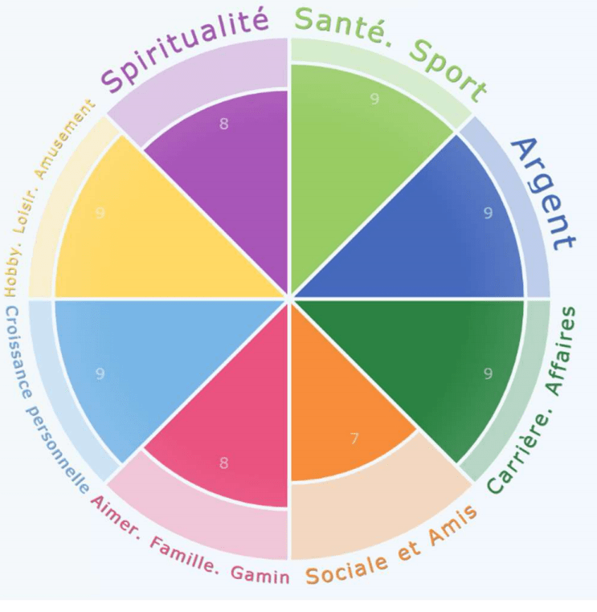
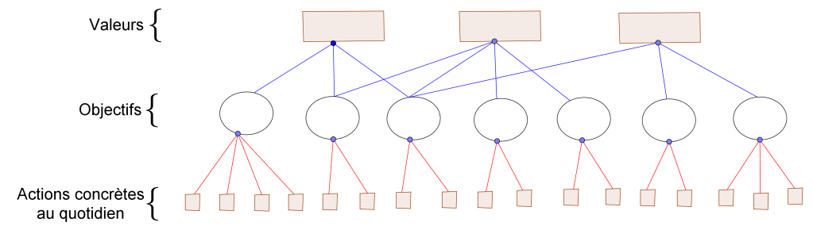

Voici une question anodine : _**A quoi servent réellement les résolutions du nouvel an ?**_

_Perdre du poids_, _parler anglais_, _arrêter le nkongossa (les commérages)_, _devenir riche_, _se marier_, etc.

Toute ces résolutions sont séduisantes et alléchantes. Seulement, des légions de personnes ont exactement les même au 1er janvier. Pourtant, seule une poignée d’entre eux parviennent à en avoir réalisé quelques-unes au 31 décembre.

Qu’est ce qui différentie ceux qui progressent vraiment, de ceux qui reportent à la fin d’année les mêmes buts que l’année d’avant ? Une chose est certaine, il ne s’agit pas des objectifs. En effet, les gagnants et les perdants ont les mêmes objectifs. La différence est donc ailleurs.

Une autre piste serait la motivation. Cependant, il s’agit d’un leurre car on peut être motivé le premier voir le deuxième mois de l’année, mais la motivation seule est un combustible qui s’épuise.

Prenez l’analogie suivante que j’emprunte à James Clear dans Atomic Habits : Imaginez que vous ayez un tuyau à arrosage qui soit plié au milieu. A cause du pli, le débit d’eau est faible. Compter uniquement sur la motivation et la volonté revient à augmenter la quantité d’eau à la source. Cela augmentera le débit au prix d’ajouter de la friction et du stress, alors qu’il serait plus efficace de juste retirer le pli.

La leçon à retenir est à la fois dure à admettre, mais également douce une fois qu’on l’intègre : _Les résolutions nous donnent juste l’impression d’avancer et d'être vraiment déterminés à changer pour devenir une meilleure personne._ Seulement, à elles seules, elles ne sont pas suffisantes pour réellement progresser.

On s'imagine souvent faussement que les transformations personnelles s'effectuent avec de grandes révolutions plutôt qu'avec la mise en place de petits changement au quotidien.

Si malgré votre bonne volonté et votre envie sincère de faire une révolution complète, vous constatez que chaque année vous avez l’impression de faire du surplace, alors comprenez que le problème ce n’est ni vous, ni votre entourage. **Le problème, c’est votre système.**

Les objectifs sont importants, mais ils ne sont là que pour donner des directions. Pour réellement avancer, il faut mettre en place des systèmes efficaces qui se battent tant bien que mal pour vous aider à vraiment évoluer.

Cet article propose une réponse sommaire à la question : **Comment prendre des résolutions de manière efficace ?** Non pas uniquement sur une année, mais de manière globale sur la vie entière (ou plutôt ce qu’il en reste).

Il s’agit d’exercices concrets, que vous pouvez mettre en place dès aujourd’hui, et qui vous conduirons jusqu’à la destination finale. Vous n’êtes pas obligé de tout faire en une fois. Vous pouvez revenir de temps en temps à cet article pour continuer à faire les exercices au fur et à mesure.

Les trois étapes principales de la méthode sont les suivantes : **Classifier les buts à atteindre** ; **Trouver son pourquoi** (bâtir son système de valeur) ; et **Bâtir son système**.

        **I. Notre identité forge nos habitudes et vice-versa**

La nouvelle année est toujours une bonne occasion pour faire un bilan honnête du déroulé précédent et établir de nouvelles bases pour l’année qui s’en vient. Nous aimons les chiffres ronds pour débuter une aventure.

La liste des résolutions potentielles que vous pouvez avoir est infinie : _Arrêter de fumer_, _faire du sport_, _faire une activité par mois_, _participer à plus d’évènements_, etc. Complétez vous-même la liste.

Malheureusement, la multiplicité des possibles fini à terme par devenir une distraction, vu que lorsqu’on a trop d’actions potentielles à exécuter, on finit par ne plus rien faire. C'est ce que j'appelle de la **procrastination déguisée** : _Le fait de dire ce qu'on aimerait faire donne l'illusion que quelque chose est fait_.

C’est pour cela que le premier exercice que je vous recommande est le suivant : Prenez une feuille, et notez de la manière la plus exhaustive possible, tout ce que vous désirez réaliser dans la vie. Rangez les dans un tableau comme celui-ci :

| **Domaines de la vie** | **Qui est-ce que je veux être dans la vie ?** | **Qu’est ce que je veux avoir dans la vie ?** | **Qu’est ce que je veux faire dans la vie ?** | **Qu’est ce que je veux voir dans la vie ?** | **Qu’est ce que je veux partager/léguer dans la vie ?** |
| --- | --- | --- | --- | --- | --- |
| **Spiritualité** |   |   |   |   |   |
| **Santé** |   |   |   |   |   |
| **Argent** |   |   |   |   |   |
| **Carrière** |   |   |   |   |   |
| **Social** |   |   |   |   |   |
| **Famille** |   |   |   |   |   |
| **Skills** |   |   |   |   |   |
| **Divertissements** |   |   |   |   |   |

Il faut vider votre tête au maximum de son contenu pour vous défouler.

La première colonne concerne le type de personne que _vous voulez **être**_, la deuxième colonne concerne ce que _vous désirez **obtenir**_, la troisième colonne concerne ce que _vous voulez **faire**_, la quatrième colonne concerne que _vous voulez **voir**_, et la cinquième colonne concerne ce que _vous voulez **partager/léguer**_.

Comme guide pour générer des idées, vous pouvez utiliser les éléments de la roue de la vie qui contient chacun des 8 secteurs de nos vies : _Spiritualité_, _Santé/Sport_, _Argent_, _Carrière/Affaire_, _Sociale/Amis_, _Amour/Famille/Enfants_, _Croissance personnelle_, _Hobby/Loisirs/Divertissement_.

a

**_Commencer par la dimension être…_**

Comment se fait-il qu’il soit si facile de répéter nos mauvaises habitudes, et si fastidieux de maintenir des bonnes ? Il y a peu de choses qui vous apporteront autant de valeur et de bien-être que de maintenir de bonnes habitudes, et pourtant, si rien n’est fait, il y a que fortes chances que vous soyez au même point l’année prochaine (voir que vous ayez régressé).

Les mauvaises habitudes telles que l’excès de réseaux sociaux ou bien le commérage semblent coller facilement à la peau, pendant que les bonnes à l’instar de faire du sport ou bien apprendre l’anglais chaque jour sont raisonnables pour un jour ou deux, mais deviennent rapidement des corvées.

Notre erreur est que nous cherchons à modifier le mauvais élément. Pour beaucoup, le premier réflexe pour adopter un nouveau comportement est souvent de se concentrer sur ce qu’on veut accomplir. Ceci conduit à des habitudes basées sur les résultats. L’idée étant que si on a pour objectif de perdre du poids, alors il suffit de suivre un programme de régime et alors nous deviendrons une personne mince. C’est cette approche qui conduit malheureusement au plus d’abandons.

Une alternative est de construire des **habitudes basées sur l’identité**. Dans cette perspective, nous décidons d’abord que nous voulons devenir une personne mince, et nous cherchons ensuite à nous comporter comme une telle personne se comporterait.

_**La forme ultime de la motivation intrinsèque se trouve quand une habitude devient une partie de votre identité**_. _Le plus fier vous serez avec un aspect particulier de votre identité, le plus vous serez motivé pour maintenir les habitudes associées à cette identité._

Ce n’est pas que vous voulez arrêter de fumer, c’est que vous n’êtes pas un fumeur.

Ce n’est pas que vous voulez lire plus de livres, c’est que vous êtes un lecteur.

De cette manière, chaque fois que vous performerez l’habitude liée à l’identité, vous ferez un vote supplémentaire pour l’identité que vous désirez.

C’est la raison pour laquelle la partie la plus importante du système de valeur que vous bâtissez pour guider vos comportements au quotidien, c’est le choix de qui vous voulez être. A partir de cela, vous complèterez le reste des éléments du tableau.

Vous avez un exemple complet de tableau rempli ici :

| **Domaines de la vie** | **Qui est-ce que je veux être dans la vie ?** | **Qu’est-ce que je veux avoir dans la vie ?** | **Qu’est-ce que je veux faire dans la vie ?** | **Qu’est-ce que je veux voir dans la vie ?** | **Qu’est-ce que je veux partager/léguer dans la vie ?** |
| --- | --- | --- | --- | --- | --- |
| **Spiritualité** | Chrétien, Eveillé, Libre | Le salut, la connaissance du Coran, la maitrise des principes animistes | Prier quotidiennement, Jeûner, Pèlerinages, Gratitude | Paradis, Miracles | Valeurs à mes enfants, Livre de spiritualité, Dons aux orphelins/défavorisés |
| **Santé** | Sportif, Equilibré, Epicurien | Bonne santé, Equilibre | Jeûner, Sport, Marathon |   | Livre de santé |
| **Argent** | Riche, Libre financièrement | 1 milliard de patrimoine | Créer plusieurs entreprises dans la technologie | 1 milliard | Patrimoine de 1 milliard |
| **Carrière** | Modèle de la technologie, Ecrivain, Footballeur, Organisatrice d’évènement | Prix Nobel, Médaille d’or Jeux Olympiques, Carrière exemplaire, Centre de Recherche | Marathon, Jeux Olympiques, Grandes entreprises, Enseigner | Afrique prospère | Livre de philosophie des sciences, Business qui me survivent |
| **Social** | Sociable, Cultivé | Amis haut placé, Grand réseau | Participer aux grands évènements, Organiser évènements |   | Livre bibliographique |
| **Famille** | Marié, Maman | 5 enfants, beau mariage, Famille stable, Grande Maison | 3 enfants, Voyages | Mariage heureux | Education, 4 enfants, Fierté de mes parents |
| **Skills** | Bilingue, Expert Intelligence Artificielle, Experte en conduite | Maitrise de l’ordinateur, Maitrise Art oratoire, Maitrise persuasion | Certifications en Business Management, Lire livres en Communication, Géopolitique, Organisation, Gestion Financière |   | Livre de communication, Livre de Softskills |
| **Divertissements** |   | Télévision, Voiture, Téléphone, etc. | Ski, Parachute, Patin, Arcades, etc. | Star Wars, Harry Potter, etc. |   |

              **II.** **Trouver son feu sacré**

Si vous avez correctement effectué l’exercice précédent, alors vous devez avoir un tableau bien rempli avec l’intégralité des choses que vous pensez vouloir et vouloir être dans votre vie tout entière.

Mais une première question se pose : **Par où commencer ?**

C’est là que plusieurs personnes se plantent. Ils vont essayer de faire un peu de tout, et donc ne rien faire sérieusement pour finir. Ou bien ils vont commencer pendant un temps, et puis abandonner.

Nous avons besoin d’un filtre pour décider de quelles actions sont plus importantes que d’autres. Et c’est à ce niveau que vous vous rendrez peut-être compte que les désirs que vous avez manifestés à l’exercice précédent ne sont pas nécessairement ce qui correspond à votre feu sacré interne.

La première chose est de questionner chacun des éléments du tableau. Concrètement, il s’agit de répondre à la question : **Pourquoi ?**

Je veux me marier -----> Pourquoi je veux me marier ?

Je veux être un chrétien -----> Pourquoi je veux être chrétien ?

Je veux avoir une grande maison -----> Pourquoi je veux avoir une grande maison ?

C’est très inconfortable de questionner ce qui nous touche au plus intime, mais il faut faire passer tous nos désirs par cette épreuve pour savoir vraiment à quel point ils sont robustes, et évacuer ceux qui sont fragiles.

Dans cet exercice, il faut décrire avec le plus de précision possible sur une feuille les raisons de l’existence de chaque élément du tableau. Il ne faut pas se limiter à des réponses du style : _‘’C’est important pour moi’’_ ou bien _‘’C’est ce que je veux’’._ Il faut les décrire en utilisant le plus possible des mots liés aux émotions.

C’est exercice n’est pas évident. Il est très difficile car il touche à notre être en lui-même dans sa dimension la plus profonde et la plus vulnérable.

On peut aller encore plus loin, plus profond, creuser encore plus bas, et extirper l’information **Vraie**.

Les neuroscientifiques nous expliquent que les actions en elles-mêmes que nous menons au quotidien correspondent à une zone du cerveau que l’on appelle le **Néocortex**, ou **cortex préfrontal**. Ce serait la partie analytique du cerveau où l’on retrouve des chiffres, des études rationnelles de comparaison avantages/inconvénients, etc.

En revanche, la zone du cerveau où l’on retrouve réellement nos comportements et nos prises de décisions s’appelle la **partie limbique centre-encéphalique**. Ce serait dans cette même zone que l’on retrouve nos émotions.

C’est la raison pour laquelle ce qui nous motive et nous fait vraiment bouger, ce n’est pas en soi notre étude rationnelle des avantages qu’il y a à avoir un tel ou tel comportement. Mais, c’est l’émotion associée à ces comportements. Il est contre-productif de chercher à combattre nos mauvais comportements uniquement en étudiant rationnellement leurs conséquences.

Toutes les habitudes que nous avons (surtout celles que l’on qualifie de mauvaise) d’une manière ou d’une autre, nous apportent un bien fait. Fumer par exemple retire immédiatement le stress et fait planer instantanément. C'est pour cela que des gens le consomme.

La vraie raison pour laquelle on qualifie certaines habitudes de bonnes et d’autres mauvaises, est qu’en général une habitude qui apporte un bienfait à court terme (manger des sucreries), conduit à des méfaits à long terme (prendre du poids). Et réciproquement, les bonnes habitudes ne sont pas agréables sur le moment (ouvrir un livre d’anglais), mais tellement puissantes sur le long terme (devenir bilingue).

La méthode pour trouver son pourquoi consiste à extirper parmi toutes ses expériences émotionnellement fortes du passé, celles qui nous ont le plus marqué et qui nous représentent dans notre _optimum naturel._

Il faut revisiter et sélectionner 10 évènements marquants de votre vie jusque-là, et collecter au final 6 d’entre eux. A terme, nous allons viser une relecture complète de votre vécu jusqu’à aujourd’hui.

**Approche 1 :** Tracer sur une feuille une ligne du temps qui va de votre naissance (1991 par exemple) jusqu’à aujourd’hui (2024). Pour chaque année, noter les évènements et les personnes qui vous ont marqué.

1991 ------------  2000  ------- 2007 ----------------------2018------------------- 2024

**Approche 2 :** Donner des réponses aux questions suivantes :

**i. Qu’est ce qui provoque chez vous une extase ?**        **ii. Avec quoi avez-vous été béni (ou quels sont vos dons) ?**         **iii. De quoi avez-vous honte ?**         **iv. Qu’est-ce qui vous mets en colère (vous mets hors de vous) ?**

Pour chaque évènement ou personne, lorsque vous décrivez cet évènement, insistez sur les émotions, cherchez à chaque fois deux éléments récurrents, identifiez votre contribution au résultat, cherchez l’impact de ce souvenir, et trouvez des anecdotes pour vous décrire vous à votre optimum naturel.

Le bon pourquoi doit être perpétuel. Il doit être la raison pour laquelle vos amis vous adorent. S’il représente un métier, il devrait être un de ceux où on rentre à la maison le soir en se disant : _‘’C’était génial, je l’aurais fait même sans être payé’’._ A terme, on vise des activités exaltantes et utiles aux autres de sorte que vous vous réveillez chaque matin en vous disant : _‘’J’adore ce que je fais’’._

Avec ceci, vous êtes prêt à formuler votre pourquoi. Il doit être **clair**, **simple**, **réalisable**, **focalisé sur l’impact sur autrui**, et s’écrit :

……… _de manière à_ ……..

Les premiers pointillés correspondent à votre contribution, et les derniers pointillés correspondent à l’impact de votre contribution.

**Exemple :**

**_Je deviens une référence mondiale en intelligence artificielle_** _de manière à_ **_inspirer les jeunes africains pour leur montrer que tout est possible._**

           **III.** **_Bâtir son système_**

Vous êtes ressorti de l’épreuve d’avant avec un système de valeurs solides.

En dessous de ceux-ci, vous avez les objectifs de la section I. dont chacun est attaché à une de vos valeurs fortes.

Le but à terme est d’obtenir un schéma comme celui-ci dans lequel chaque action que vous menez au quotidien sert de manière indirecte à vous conduire vers une version de vous authentique et dont vous êtes de plus en plus fier.

Maintenant, vous devez décliner vos objectifs suivants plusieurs horizons : Court terme (sur un an), Moyen terme (sur trois ans), Long terme (sur 5 ans) et Très Long terme (sur 10 ans).

Chaque année, vous pouvez faire cet exercice et revenir pour ajuster ce qu’il faudrait dans l’éventualité où vous avez mis à jour votre vision du monde.

Le but d’écrire en détail ces différents horizons est de vous rassurer que les activités que vous projetez de réaliser pour l’année en cours servent des projets beaucoup plus grands et qui vous dépassent.

Les deux caractéristiques que doivent posséder chacun de ces objectifs suivant l’horizon, est qu’ils doivent être relativement **challengeant** (pas trop facile à accomplir), et **s’étaler sur la période d’intérêt** (par exemple doivent se faire petit à petit tout au long de l’année) **de manière SMART** – Spécifique, Mesurable, Atteignable, Réaliste, Temporellement défini.

De cette manière, vous gardez une vision cohérente sur l’identité que vous voulez incarner ; et en passant vous avez défini des résolutions pour l’année.

**Exemple :**

|     1 an | **Faire :** Epargner 1 million |
| --- | --- |
| **Être :** Mariée |
| **Avoir :** 1 enfant |
| **Faire :** Jeûner chaque vendredi |
| **Être :** Bilingue |
|     3 ans | **Faire :** Lancer mon entreprise |
| **Être :** Chrétien ancré (qui prie tous les jours) |
| **Être :** Footballeur professionnel |
| **Être :** Expert en IA |
| **Avoir :** Lu plus de 20 bons livres |
|     5 ans | **Être :** Libre financièrement |
| **Être :** Trilingue |
| **Faire :** Lire toute la Bible |
| **Partager :** Don de 1 million à 5 orphelinats |
| **Avoir :** Santé stable |
|     10 ans | **Faire :** Jeux Olympiques |
| **Être :** Bon père de famille |
| **Avoir :** Prix Nobel |
| **Être :** Extrêmement cultivé |
| **Avoir :** 1 millard en actif |

Pour ce qui est de la machine proprement dites à mettre en place pour atteindre ces objectifs, elle est beaucoup plus complexe, mais faisable. Si vous êtes intéressés par ce type de contenu, alors inscrivez-vous à la [Newsletter](https://mailchi.mp/043d8982459e/gueyordimnewsletter) pour ne pas manquer des informations diffusées uniquement par ce canal-là.

Partagez cet article à ce cousin qui vous envoies toujours les vœux du nouvel an et qui prend beaucoup de nouvelles résolutions qu’il n’arrive pas nécessairement à tenir.

Bonne année 2024 ! Je vous souhaite une année productive.

Alain Didier.
