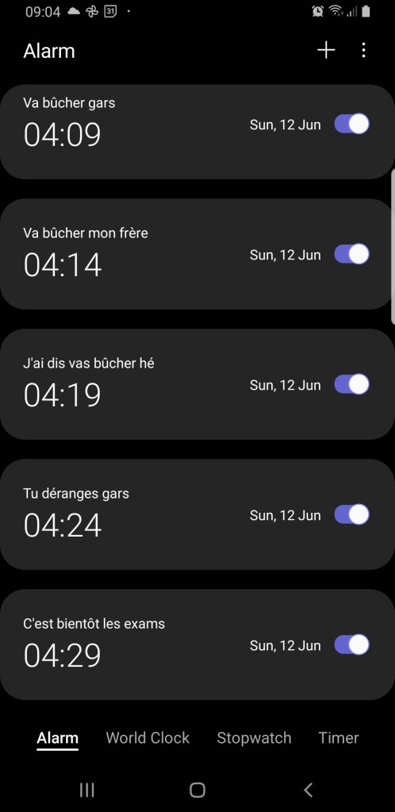

Vous avez tout essayé : Augmenté le volume du son, Mis des sonneries énervantes, Placé votre réveil loin pour vous obliger à vous lever, Programmé 10 alarmes consécutives. 

Malgré tout, rien… Soit vous n’entendez pas le réveil lorsqu’il sonne, ou bien vous vous levez pour l’éteindre et retournez-vous rendormir, ou encore vous ‘’snoozez’’ toutes les alarmes que vous avez-vous-même programmé jusqu’à la dernière.

En un sens, c’est comme si vous conspiriez contre vous-même pour déjouer tous les guet-apens que vous vous êtes posés pour vous inciter à vous lever tôt.

Vous finissez par vous convaincre que le problème c’est vous, que vous n’êtes pas du matin ; mais que vous êtes plutôt un oiseau de nuit.

Si cette description vous parle, alors sachez que le problème ce n’est pas vous, ou bien vos astuces du matin. Il y a juste de fortes chances que vous vous méprenez sur comment fonctionne réellement la motivation humaine. Mais vous n’êtes pas seul dans cette situation. La plupart des gens autour de vous ont exactement le même problème, mais ils ne vous le diront pas, ou ils n’en sont pas eux même conscient.

Les gens s’imaginent qu’ils vont arriver, ne rien changer à leur système global d’organisation, modifier juste l’heure du réveil ; et puis hop, ils vont passer à un nouveau mode de fonctionnement dans lequel ils seront hyper productifs. Si c’était si simple, on n’aurait pas besoin de rédiger tous ces articles de blog.

C’est regrettable, mais vous pouvez même être Eisenhower ou n’importe quel autre génie de l’organisation ; malgré tout il y a 3 principes -presque de la nature- desquels vous ne pouvez aller à l’encontre si vous voulez être plus productifs.

Je vous révèlerais ces principes au fur et à mesure qu’on répondra à la question : Pourquoi c’est si difficile de se lever tôt ? Et comment être du matin ?

Mais premièrement, si vous n’êtes pas du matin, alors il y a de fortes chances que vous n’en ayez pas réellement envie intrinsèquement. Je vais donc commencer par vous donner des arguments pour vous convaincre qu’être du matin pourrait tout changer pour vous.

**I. The Miracle morning**

Avant tout, il faut bien intégrer que se lever à 4h du matin par exemple implique se coucher à 21h ou 22h. Vous ne pouvez pas vouloir vous lever plus tôt et continuer à dormir à votre heure habituelle : c’est un non-sens biologique. De toute manière, le corps le fera ressentir ; et c’est globalement inefficace pour la productivité de diminuer son nombre d’heures de sommeil.

C’est la première barrière sociale que vous rencontrez si vous voulez vous lever plus tôt en étant efficace : Vous allez passer pour une chochotte qui dors à la même heure que les enfants.

Ducoup, c’est légitime de se demander : ‘’Au final, si mon nombre d’heures de sommeil est le même ; quel avantage réel y a-t-il à se lever plus tôt ? ’’

Aussi paradoxal que cela puisse paraitre, les avantages sont nombreux ; et il y a d’ailleurs un gain social immense à être du matin.

1. **Comment finir sa journée à 8h ?**

Le premier principe de la nature qui s’applique en productivité, est une loi de probabilité qui peut s’énoncer de la manière suivante : _**L’unique évènement prévisible est l’existence d’imprévus**_.

Si je devais parier, je ne mettrais pas un centime sur les gros modèles économiques qui prédisent la production locale de maïs pour 2050. Le souci n’est pas le modèle statistique ou bien le niveau des ingénieurs qui conçoivent ces modèles. Le problème c’est que le monde dans lequel nous baignons est trop compliqué pour nous. On ne peut pas prédire des guerres, des famines, des crises, des épidémies, etc. qui viennent perturber significativement ces modèles -évidemment, rétrospectivement on donne toujours des explications, mais ce n’est pas le propos de cette publication.

Au niveau de l’organisation c’est pareil : On ne peut pas prédire les services urgents que les autres auront besoin qu’on leur rende. C’est pour cela qu’il faut minimiser ce risque.

Les imprévus dans l’organisation viennent en grande partie des autres qui nous interrompent dans nos tâches.

Je suis toujours surpris quand des étudiants viennent se plaindre auprès de moi qu’ils n’arrivent pas à étudier normalement parce qu’ils sont dans une famille nombreuse et qu’on les sollicite très souvent pour des services ; et la conséquence c’est qu’ils ne peuvent pas étudier comme les autres étudiants. C’est bien trop facile comme excuse.

L’idée de se lever tôt, c’est de se réveiller pendant que tous les autres dorment encore. Par conséquent, il y a la possibilité d’achever toutes les tâches de la journée à l’aurore. De cette manière, pendant que le monde se réveille, vous, vous aurez déjà terminé votre journée. Le reste de la journée peut être perdu, mais quelque chose de concret aura déjà été fait, et la journée n’est définitivement pas perdue.

Le gros avantage de ce point de vue est que les risques d’interruption sont minimisés à l’extrême ; et de ce fait, les interruptions en journée sont bien moins irritantes ; et il reste possible de garder des relations cordiales avec son entourage uniquement grâce à ce shift de l’heure du réveil.

Ce qui nous déçois généralement par rapport à nos journées n’est pas le fait que nous n’ayons pas atteint nos objectifs, mais plutôt qu’on a le sentiment d’une journée perdue et gâchée : une gabegie temporelle, qui est évitable en se levant plus tôt.

**2\. La guerre du matin**

Une journée réussie = une matinée réussie. C'est un **théorème!**

Il y a plusieurs études qui tendent à montrer que les personnes qui sont satisfaites d’une de leur journée sont satisfaites également de leur matinée.

Ducoup globalement, ceux qui démarrent leur journée en réalisant les objectifs de la matinée terminent la journée en étant fier d’eux ; alors que ceux qui démarrent la journée en se jetant sur le téléphone immédiatement vont avoir tendance à trouver globalement leur journée pourrie.

La guerre de la journée c’est le matin. Et lorsque vous vous levez tôt, vous avez de la marge pour bien faire les choses. Par contre, quand vous vous levez aux heures limites, vous commencez la journée avec tout le stress du monde parce que vous cumulez des contraintes qui ne viennent pas de vous.

**3\. Se lever tôt, c’est fun !**

Si malgré tout je ne vous ai pas convaincu que se lever tôt, c’est fun ; alors très probablement vous n’avez pas encore trouvé un sens profond à l’activité que vous faites au quotidien.

Ce que vous faites, c’est parce qu’il ‘faut’ le faire ; ou bien vous aimez bien l’activité mais sans plus. Ce n’est pas une activité de laquelle vous vous réveillez chaque matin en vous disant : _‘’Waouh, j’adore ce que je fais !’’._

Si c’est votre cas, alors sans doute ce n’est pas une si bonne idée de vous forcer à vous lever plus tôt. Ce n’est pas la fin du monde, ce n’est pas une mission de vie d’être du matin non plus.

Je vous souhaite juste de trouver ce sens : de trouver cette braise qui allumera votre étincelle chaque matin ; pour laquelle vous ferez votre activité parce que VOUS voulez la faire, et non parce qu’on vous a dit de la faire ou bien parce que ça donne l’argent.

**II. Les principes à connaitre**

1. **La biologie de la matinée**

Le deuxième principe naturel qui s’applique en productivité est une conséquence des lois de la gravitation de Newton. On peut l’énoncer : _**Le soleil se lève le matin et se couche le soir**_. Il va de pair avec le troisième principe qui cette fois si est purement biologique : **_Au réveil, le corps humain sécrète du cortisol ; et au coucher de la mélatonine_**.

Concrètement, cela signifie que nous avons des cycles dans le sommeil : Ce n’est pas le fait de dormir plus qui permet de récupérer plus. Vous pouvez être plus fatigué après avoir dormi 8h de temps qu’après avoir dormi 6h de temps.

Je raconte cela parce que nous avons un cycle propre (appelé **cycle circadien**) : une sorte d’horloge biologique intérieure qui nous indique quand nous réveiller (en sécrétant entre autres du cortisol -hormone du stress- , mais aussi d’autres hormones et peptides telle l’hormone CRH, ou les endorphines) ; et quand nous endormir (en sécrétant de la mélatonine, du tryptophane, de la sérotonine, de la valentonine, etc.)

Traditionnellement, la sécrétion de ces hormones et peptides est directement liée à la position du soleil. Et ceci n’est pas propre qu’aux humains : la quasi-totalité du règne animal (à l’exception de quelques animaux comme les hiboux) se met en mode sommeil pendant l’absence du soleil.

Le problème c’est que nous -à cause de la pollution lumineuse- avons nos cycles perturbés.

Si vous avez donc la possibilité de vous exposer à la lumière naturelle, il ne faut pas hésiter ; et retrouver des cycles en phase avec le soleil.

**2\. La tragédie de la volonté**

La volonté n’est pas une quantité infinie. Bien sûr il y en a qui en ont plus que d’autres, mais pour un seul individu, la volonté fonctionne comme une pile qui se décharge à chaque fois que nous prenons des décisions : ‘’Je prépare quoi aujourd’hui ?’’, ‘’Je porte quoi aujourd’hui ?’’, ‘’Je vais où aujourd’hui ?’’, etc.

C’est pour cela qu’on a plus de volonté le matin. C’est la raison pour laquelle c’est en matinée qu’il faut réaliser les tâches dures, sales ; celle qu’on n’a pas envie de faire là. Parce qu’on en aura encore moins envie dans l’après-midi ou en soirée. Les américains disent : ‘’Eat the frog in the morning’’. Il faut commencer les journées avec les tâches ingrates et désagréables. De cette manière, même si les imprévus du reste de la journée sont trop importants, la journée est somme toute réussie vu qu’un gros morceau a été abattu.

**III. Les solutions concrètes**

1. **Les sirènes du téléphone**

Le téléphone c’est un des outils les plus dangereux de la productivité. C’est comme les sirènes : Il est attractif, mignon, et semble inoffensif. Mais c’est un violeur de productivité hors pair : Il nous tente pour nous corrompre, nous donne une satisfaction éphémère en ayant tout détruit sur son passage y compris la journée.

Il n’y a pas de méthode de productivité complète qui ne traite intégralement le cas du téléphone. Aujourd’hui on aborde une minuscule partie de la problématique du téléphone. Mais si vous voulez être sûr d’avoir accès à du contenu privé, inscrivez-vous tout de suite à la Newsletter en cliquant sur ce [lien](https://mailchi.mp/043d8982459e/gueyordimnewsletter).

Le conseil rapide c’est : Ne dormez pas à côté de votre téléphone, Et ne vous réveillez pas avec le téléphone.

Pour être plus spécifique, l’idéal c’est qu’il n’y ait pas d’utilisation du téléphone 1h avant votre couché ; et 2h après votre réveil. Moi je vais même encore plus loin parce que je ne m’autorise à le toucher qu’après avoir terminé la grosse tâche du matin.

Ça peut vous paraitre un peu radical. Je pourrais argumenter des raisons pour lesquelles ça marche, mais je le ferais sans doute dans une autre publication. Essayez juste, et constatez les résultats.

Je veux juste répondre à quelques objections qui pourraient surgir par rapport à cela.

**Objection 1 :** Mais je fais comment si j’ai reçu des messages dans la nuit ?

**Réponse 1 :** Tu les regarderas après la tâche prioritaire du matin. Il y a un biais humain que les concepteurs de réseaux sociaux utilisent, ça s’appelle le FOMO : Fear Of Missing Out. C’est la peur que quelque chose d’incroyable se produise à notre insu. Quand la notification sur Facebook dit : Tonton Atangana a réagi à votre publication, en fait vous vous fichez de l’avis de tonton ; mais ça parle de vous. Il faut combattre ce biais parce qu’à la longue il tue la productivité.

**Objection 2 :** Mes contacts vont se plaindre que je ne leur réponds pas.

**Réponse 2 :** C’est justement le point de se lever tôt. Tout le monde dort pendant que tu fais la tâche prioritaire de la journée. Du coup, quand tu la termine et que tu réponds à tes messages, cela correspond à l’heure normale de réveil des autres.

**Objection 3 :**  Mon réveil est sur mon téléphone. Comment je fais pour ne pas y toucher à mon réveil ?

**Réponse 3 :** Au pire j’aurais même recommandé d’avoir un réveil à part entière ou bien sur son ordinateur. Mais si ce n’est vraiment pas possible d’avoir un réveil autre que sur son téléphone, il est possible d’éteindre son réveil sans déverrouiller le téléphone sur la plupart des smartphones. Le seul point est qu’il faut à tout prix éviter d’être immergé dans le monde virtuel au réveil. Ce n’est pas une bonne idée de se croire plus malin que nos biais humains en se disant : ‘’Je regarde juste cette fois rapidement les news sur les réseaux, ça ne peut pas me faire de mal’’. C’est le langage de la tentation du diable, le malin veut vous corrompre.

**2\. Il faut savoir exactement ce que vous allez faire**

Pour que tout ce que je viens de vous présenter fonctionne, il faut que chaque nuit au couché vous sachiez déjà exactement ce que vous allez faire le lendemain au réveil. On n’improvise pas dans la productivité matinale.

Autrement, vous allez retourner machinalement dans vos mauvaises habitudes courantes.

Le plan précis pourrait être : ‘_’Quand le réveil sonne, je me lève pour l’éteindre, je mets le téléphone dans une autre pièce, je me mets de l’eau froide au visage, je me brosse les dents, je prie, je me lance dans la tâche prioritaire de la journée (qui est décidée la veille et non au matin), je regarde mes emails, je regarde mon tel, etc.’’_

**3\. N’appuyez pas sur snooze**

Il faut éviter d’appuyer sur le bouton snooze de votre téléphone. Et éteindre le réveil directement.

Si vous avez besoin de shoot de motivation, imaginez juste que vous êtes dans une maison en feu et que vous devez fuir pour vous en sortir. N’allez pas sur YouTube pour écouter toutes ces vidéos de motivations. C’est de la daube, des gens dont le métier est de vous garder en permanence à regarder leurs contenus, et qui ne veulent pas forcément vous donner des armes pour que vous puissiez vous en émanciper justement.

Excellent Week-end à vous,

Alain Didier.

P.S : Message pour ceux qui lisent régulièrement ce blog. C’est de plus en plus rare de trouver des gens qui lisent à cause de la Tiktokisation du monde. Merci pour votre soutient. J’ai fait un moment sans publier de nouveaux articles, désolé. Je ne suis pas un influenceur. Mon rôle c’est de proposer des outils pour s’émanciper justement de la tyrannie d’internet, et non pour produire des esclaves comme le font certains influenceurs.

N’hésitez pas à partager cet article si vous pensez qu’il peut apporter de la valeur à quelqu’un.
