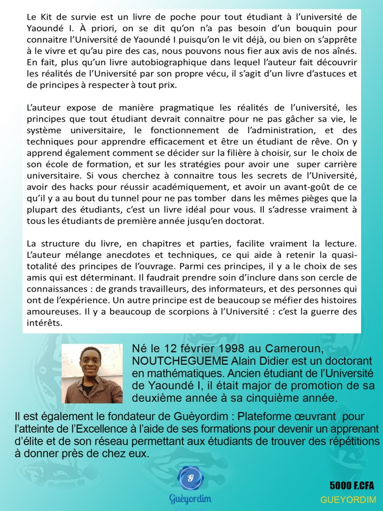

Sur ce blog, nous partageons beaucoup de conseils pour devenir meilleurs en tant qu’étudiants, et du point de vue de l’apprentissage en général pas uniquement scolaire.

Seulement, nous n’avons encore jamais abordés la question du sens de ce qu’on étudie à l’Université : Pour quelle raison devrais-tu ou pas étudier ? Et est ce le style de vie que tu veux vraiment ?

D'ailleurs beaucoup d'influenceurs disent que l'école ne sert à rien.

Peut-être pour toi aujourd’hui l’Université n’est pas vraiment un lieu de kiff ou de grande joie, peut-être c’est juste un moyen parmi d’autres que tu as trouvé pour espérer un avenir ; ou même peut-être que tu es juste à l’Université malgré toi, parce que rien d’autre n’a fonctionné et tu es là en fait essentiellement pour passer le temps en attendant que tes autres projets marchent. Et du coup, tu fréquentes uniquement parce que c’est la seule chose à faire, et tu ne te donne pas à fond parce que ça ne t’intéresse même pas en fait.

Si c’est le cas, c’est vachement dommage quand même. C’est vrai qu’on communique assez peu souvent sur les opportunités que peuvent offrir l’Université et comment les trouver et les saisir : généralement nous sommes plus dans une logique de dénigrement et diabolisation, si bien qu’il est possible de finir par croire que c’est un mouroir surtout chez nous en Afrique.

Avant même que tu ne puisses t’ouvrir aux petites tactiques qui sont partagées dans les autres publications, je crois qu’il y a le problème de trouver du sens à ce que tu fais auquel il est important de répondre urgemment.

Je suis un matheux de formation et j’ai personnellement pété les plombs deux fois à l’Université : Une fois après mon Master 1, et l’autre après mon Master 2. La deuxième fois, il s’agissait d’une crise existentielle profonde doublée de pensées suicidaires.

Si tu étudies par exemple les sciences de la terre ou même des langues, tu as au moins la chance que ce que tu étudies ait un rapport avec le réel même si c’est juste dans ton cahier que tu dessine les figures.

Imagine la filière maths, là où l’abstraction est reine, et où on cherche à se détacher au maximum du concret : c’est marrant trois ans, mais après… Il faut du sens.

Après, il faut avoir une idée des différentes opportunités envisageables de ce qu’il est possible de faire concrètement avec un diplôme universitaire. Je ne vais pas en parler dans cet article vu que tous ces concepts sont disponibles dans le livre _[l’Université de Yaoundé I de A à Z, le Kit de Survie](https://gueyordim.com/livre/)_.

A la place, j’aimerais te dire dans cette publication ce que tu peux faire si ton problème réel c’est le manque total de motivation. Il se peut bien que tu traines des pieds pour étudier ou même pour venir en cours, et ce n’est que lorsque les examens approchent que tu trouves le boost d’énergie pour vite étudier, et bien entendu tout oublier la semaine d’après.

Le problème, ce n’est pas que l’école n’est pas faite pour toi ou que tu n’es pas doué pour les études. Le problème c’est que tu n’as pas encore trouvé de sens à tes études.

Dans ma publication de la semaine dernière sur l’addiction, j’ai résumé les quatre étapes de toute habitude. Je te rappelle vite fait : c’était **Déclencheur-Désir-Routine-Récompense** (Si tu veux tous les détails, va voir cette [publication](https://gueyordim.com/2021/07/11/99/) après avoir fini de lire celle-ci).

Je ne vais parler tout de suite que du Déclencheur. Si tu veux prendre l’habitude d’étudier, il te faut un déclencheur. Il y a essentiellement deux types de déclencheurs : **Les déclencheurs externes** et **les déclencheurs internes**.

Les déclencheurs externes sont efficaces, mais ils ne peuvent fonctionner que sur une courte période. Des exemples de déclencheurs externes peuvent être : des **vidéos de motivations** ; un **livre tel que l’Université de Yaoundé I de A à Z, le Kit de Survie**  ; des **alarmes** ; des **notifications** ; etc.

C’est vrai que j’ai un peu menti parce que le livre est en réalité à mi-chemin entre un déclencheur externe et interne. Pourquoi ? Parce qu’à la fois tu obtiens la motivation en écoutant le parcours d’une autre personne, ses difficultés et ses mésaventures ; et en même temps le livre te permet de te poser les bonnes questions qui modifieront ta façon de voir le monde, et in fine te permettront de paramétrer tes déclencheurs internes.

Tu l’as compris, les déclencheurs internes ont rapport avec ta personne : tes **émotions**, tes **valeurs**, et c**e que tu as de plus cher à tes yeux**.

Freud disait que la pulsion sexuelle se cachait derrière la plupart de nos comportements : ceci pourrait par exemple être un prétexte pour l’attacher à un déclencheur interne de l’envie d’étudier : si par exemple ta plus grande crainte est de finir vieille fille ou bien d’être un gars sans relations sérieuses, l’apprentissage pourrait très bien être un très bon light motiv.

Sinon, tu peux aussi travailler à attacher à certaines de tes émotions le désir d’étudier. Ceci peut se faire avec des efforts, et d’ailleurs Facebook y est parvenu : pour la plupart des gens, à chaque fois que la sensation d’ennui s’installe (déclencheur interne), le résultat inconscient est de dégainer son téléphone et d’ouvrir l’application bleue. Les émotions positives et/ou négatives peuvent être un bon moyen de se motiver.

Attention, je ne dis pas de faire une introspection pour en un jour changer sa vie, il est mieux de faire le changement pas à pas ; ou bien de se faire accompagner pour ce genre de démarche.

Bon, j’ai déjà beaucoup bavardé de choses théoriques. Concrètement que dois-tu faire dès demain pour gagner cette habitude ?

Concrètement, il faut deux choses : Premièrement, il faut que tu **saches si tu as vraiment envie de faire les études** que tu es en train de faire actuellement.

Il faudrait que faire des études soient un désir personnel et non une contrainte extérieure, sinon toutes les vidéos de motivations et toutes les tactiques ne seront qu’éphémères. Pour cela, tu dois pouvoir répondre à la question : **Pourquoi est ce que je veux étudier ?** Et vérifier si ce pourquoi est attaché à des valeurs assez fortes.

Si la réponse à cette question est oui, alors il faut la deuxième clé est que tu dois **tomber littéralement amoureux(se) d’un projet**. Il faut que pour chacun de tes cours, en parallèle de ceux-ci, tu te donnes un mini thème simple et le plus pratique possible à explorer et qui fasses intervenir une notion que tu es entrain d’apprendre. Par exemple, si tu suis un cours de psychologie sociale, un mini thème pourrait être : comment les processus interpersonnels influencent nos décisions d'achats ?

**L’amour est la seule composante** à ma connaissance **qui puisse supprimer le temps**. Tu sais, au secondaire j’étais un élève à problèmes : le genre qui faisait rire ses camarades et qui était complètement nul dans toutes les matières littéraires. Paradoxalement, il y a deux ans je me suis intéressé très fortement aux concepts de productivité et de pédagogie, ceci m’a amené à étudier des domaines sombres et que je n’aurais jamais soupçonnés un jour tels le marketing, la psychologie, la communication, les méthodes mnémotechniques, etc. Je suis même allé jusqu’à écrire un livre, moi l’anti littéraire. Malgré tout, je continue d’apprendre ces choses littéraires, et je ne sens pas du tout la pénibilité car mon déclencheur interne est assez fort.

Je peux te le révéler : Mon pourquoi est: **d’augmenter une dimension à l’éducation chez nous en Afrique**; et c’est pour cette raison que j’écris des livres et que j'ai une page Facebook. Du coup, comme j’ai cette ligne directrice, toutes les compétences qu’il me faut apprendre se greffent naturellement transitivement et sans effort de ma part, et au contraire je prends du plaisir dans ce qui était une corvée avant.

Un dernier exemple, et je vais te laisser sur cette note c’est celui d'Euler. Un très grand mathématicien qui a formalisé le concept de fonctions, et d’ailleurs c’est à cause de lui que la fonction exponentielle se note ‘’e’’. Il se trouve qu’à un moment de sa vie (après son Bac), ses parents voulaient qu’il fasse des études en théologie, mais lui voulait plutôt étudier les mathématiques et n’aimait pas la théologie. C’est là que Gauss (très grand mathématicien contemporain) est intervenu pour demander à ses parents de le laisser faire des mathématiques vu son potentiel. Au final, Euler aura fait des mathématiques, jusqu’à devenir le grand génie qu’on connait aujourd’hui.

Seulement, l'histoire ne s’arrête pas là : après avoir délivré l’Univers des maths, il est rentré pour étudier maintenant la théologie car au fil du temps, il avait développé une passion pour le divin, et cela n’a été que facile pour lui.

a

La paix sur toi.
