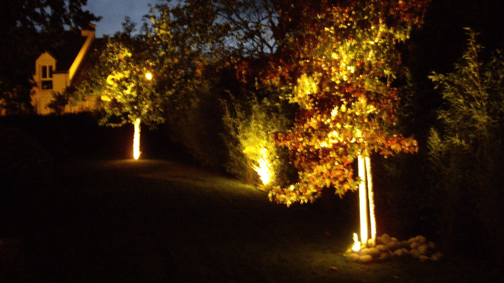

Il était une fois un sultan de l’empire du Mali. Ce Sultan était extrêmement riche, et la légende veut qu’à un moment de l’histoire, il possédait à lui tout seul la moitié des réserves d’or mondiales.

Seulement, ce sultan avait pour lui un trésor encore plus précieux que tout l’or du monde. Il le conservait jalousement dans sa cave à l’extérieur du château, après le jardin ; et il n’y avait qu’une seule clé permettant d’ouvrir le fameux coffre renfermant le secret des milles et une nuit.

Ce soir-là, le sultan désirait profiter de son trésor. Il sortit de son château, traversa le jardin, entra dans la cave, et se tenait devant le coffre. A ce moment, il se rendit compte qu’il ne détenait plus la clé du coffre malgré qu’il soit sorti avec. Il s’exclama donc : ‘’Mais où est la clé du coffre des milles et une nuit ?!’’.

Naturellement, il rentra sur ses pas à la recherche de la fameuse clé. Il faisait très sombre dans le jardin, donc trouver cette clé s’avéra difficile. Heureusement, le sultan tomba sur trois lampadaires qui éclairaient une partie du jardin.

<figure>

<figcaption>

espritvegetal.fr

</figcaption>

</figure>

Fou de joie, il se laissa attirer par cette zone pour chercher ladite clé. Malheureusement, toujours rien…

Il hurla si fort que deux de ses serviteurs sont sortis pour comprendre ce qui se passe. Le sultan leur expliqua qu’il est à la recherche de la clé du coffre, et ils se proposèrent donc de l’aider à la chercher toujours dans la zone éclairée du jardin.

Malgré tous leurs efforts conjoints, ils ne trouvèrent toujours rien. La nuit n’avait jamais été aussi sombre de l’année.

Ils ont continué à chercher toute la nuit sous le lampadaire mais sans rien trouver.

Au petit matin, le prince sorti du château pour rejoindre son père dans le jardin. Le jeune prince demanda à son père ce qu’ils font là dans le jardin. Il lui répond : ‘’Mon fils, ton père a égaré la clé du coffre des milles et une nuit, tu ne pourras malheureusement pas hériter du trésor’’. Le prince tendit la main, montra une clé et lui demanda : ‘’Est-ce de cette clé que tu parles, papa ?’’. Le sultan lui répond : ‘’Mais où as-tu trouvé la clé du coffre ???’’ Le prince lui répondit : ‘’En plein milieu du jardin papa.’’

Cet ainsi que beaucoup d’entre nous nous laissons attirer par la lumière. Pourtant, la vérité scientifique est très souvent loin des lampadaires : **elle se trouve dans l’obscurité**.

De même, ceux qui disent que si vous n’avez pas encore assez de résultat c’est parce que vous ne travaillez pas assez et que vous n’êtes pas assez motivés, vous envoient chercher la solution sous le lampadaire.

Il y a un biais cognitif qui nous fait croire que plus nous fournissons d’efforts, plus nous seront récompensés (ça s’appelle le _biais du monde juste_). Il donne l’impression que si quelqu’un est plus compétent que vous, alors cela signifie qu’il a juste travaillé plus dur que vous.

L’autre biais à l’extrême opposé c’est celui qui donne l’impression que l’éclair de génie est anodin. C’est le même biais qui nous fait croire que la carrière sportive d’un joueur se passe au stade à la télé plutôt que dans ses innombrables heures d’entrainement, et qu’une star se bâtit devant les feux des projecteurs plutôt qu’en coulisse.

Aujourd’hui, je veux vous inviter dans les coulisses des stades d’entrainement des personnes vraiment compétentes pour que vous ayez l’ingrédient manquant à coupler avec le travail dur pour vraiment progresser.

En effet, si aujourd’hui vous avez l’impression que vous travaillez beaucoup mais sans vraiment progresser, alors d’une chose l’une : soit **vous avez de mauvaises stratégies d’apprentissage**, soit **vous mettez les efforts aux mauvais endroits**.

**I. Devenez vraiment bon, et cessez d’en avoir juste l’air.**

Cette publication ne s’adresse à vous que si vous êtes vraiment intéressé par l’idée de devenir vraiment compétent dans votre domaine.

Si l’unique chose qui vous motive est d’avoir une grosse note, ou bien une promotion, ou bien n’importe quelle récompense de l’extérieur, alors vous ne trouverez pas de réponses à vos questions dans cette publication.

Le mec qui a inventé les examens à l’école l’a regretté juste après.

En fait, une note ou un résultat n’est efficace que lorsqu’il a pour but d’évaluer le niveau de compétence de quelqu’un. L’économiste Charles Goodhart a fait la remarque tranchante qu’ ‘’à partir du moment où l’unité de mesure devient la cible, il cesse d’être une bonne unité de mesure.’’

La morale de cette histoire c’est qu’aligner les 18/20 ne renseigne pas vraiment sur votre niveau de compétence si votre objectif de départ était la note plutôt que l’envie de devenir plus compétent.

Vous pouvez vous préparer pour un test de QI (qui n’est rien d’autre qu’un examen de plus en réalité) et avoir 300 points à ce test, mais ça ne signifie pas que vous êtes le plus intelligent du monde. L’un des critères de validité de ce test est justement que vous ne vous y préparez pas à l’avance.

Un exemple facile de cela qui me vient en tête c’est celle d’un camarade qui se croyais fort au niveau 1 parce que le fax payait. Quand les données ont changé au niveau 2 et qu'il était maintenant parmi les derniers, il s’est demandé ce qui a changé.

Il se croyait fort parce qu’il avait de bonnes notes, mais la réalité de la compétence finit toujours par revenir au galop. Retenir le fax c’est l’équivalent de mettre du parfum sur de la bouse de vache : vous pouvez camoufler l’odeur, mais pas la neutraliser.

Je raconte cette anecdote plus en détail dans la version gratuite de mon livre que vous pouvez regarder [ici](https://gueyordim.com/livre/).

C’est important pour moi de faire cette séparation nette entre compétence et mesure du résultat pour que nous ayons une utilisation de la notion d’évaluation qui va vraiment favoriser le fait de devenir compétent.

**II. Le mythe du travail acharné**

A ce niveau, je suppose que vous voulez vraiment progresser. Vous vous entrainez régulièrement, mais de temps en temps vous avez l’impression que vous êtes juste entrain de perdre votre temps.

Bien sûr, le réflexe naturel c’est de penser qu’il vous suffit d’augmenter vos heures de travail pour augmenter vos résultats; mais ce reflexe c'est encore comme regarder sous le lampadaire.

Tout le monde dit aujourd’hui que pour ‘’réussir’’, il faut sacrifier son sommeil, il faut charbonner, il faut travailler comme si sa vie en dépendait, il y a la théorie des 10000 heures de travail pour devenir un expert. On va poster une photo inspirante d’Elon Musk entrain de dire qu’il travaille 100h par semaine le regard tourné vers le futur sous un coucher de soleil enivrant. Malheureusement, ce n’est pas si simple que cela…

Si les résultats étaient fonction linéaire du travail, alors quelqu’un qui a 80/100 aurait travaillé 8 fois plus que quelqu’un qui aurait 10/100. On peut s’imaginer à la limite une personne qui travaille deux fois plus d’heures qu’une autre, mais 8 ça parait peu probable. Et paradoxalement, dans la réalité c’est souvent l’inverse qui se produit : _Ceux qui ont les meilleurs résultats investissent souvent beaucoup moins de temps dans le travail._

Ce phénomène peut être résumé par un principe physique qui m’a été illustrée par un de mes collaborateurs qui travaille à Guèyordim mais dans l’ombre : **_En physique peu importe l’intensité du travail, si la force exercée est perpendiculaire à l’axe, rien ne bouge !_**

**III. Comment devenir vraiment bon**

Pour faire des progrès réels, il vous faut pratiquer délibérément dans l’unique but de vous améliorer et de dominer les concepts.

1. **Objectifs clairs et Feedback rapide**

Chaque séance de travail doit avoir un but clair, et vous devez recevoir un feedback le plus vite possible pour savoir si vous êtes dans la bonne direction ou pas. En un sens, c’est comme dans un jeu vidéo : pour vous améliorer, vous devez savoir quel est l’objectif à atteindre ; et heureusement la plupart des jeux vous disent immédiatement après une partie si vous avez gagné ou perdu.

Vous pouvez même pousser le bouchon dans cette image du jeu vidéo jusqu’à vous octroyer des petites récompenses aléatoires en cas de réussite.

Mais attention aux récompenses, choisissez celles qui renforcent votre personnalité, et pas celle qui vous en éloigne. Par exemple, si vous êtes au régime, ne vous récompensez pas avec des bonbons. Mais si vous êtes un fan de lecture, promettez vous que si vous atteignez tel objectif, alors vous achèterez un livre par exemple.

2\. **Identifiez clairement honnêtement vos faiblesses**

Dans toute mon expérience d’enseignement, j’ai réalisé que ce qui bloque surtout les étudiants est qu’ils ne savent pas ce qu’ils ne savent pas. Ils évoluent avec des lacunes qu’ils trimbalent depuis plusieurs années et ne se rendent en fait pas compte que ce qui les bloque vient du passé.

**Connaitre ses faiblesses est une force.**

Pour identifier vos faiblesses, la première approche est d’observer les zones où vous n’êtes pas à l’aise. La deuxième approche (plus efficace) est d’essayer d’expliquer des concepts, et lorsque vous sentez la chaleur monter, cela signifie que vous avez mis le doigt sur vos faiblesses.

Ne niez pas vos faiblesses, n’en ayez pas honte. Regardez-les en face, et prenez le temps de combler proprement vos lacunes cette fois ci.

Pratiquez encore et encore jusqu’à ce que vous deveniez finalement vraiment bon. Tellement bon que vous pouvez vous exprimer sur le sujet sans bégayer une seule fois.

3\. **Les 3 étapes de la maitrise de toute compétence**

Pour finir, il faut savoir que la maitrise de toute compétence passe par trois étapes. Voici le [lien](https://gueyordim.com/2021/07/08/89/) de l’article que j’avais écrit à ce sujet.

**IV. Partager**

Si vous aimez nos contenus, et que cette publication vous a touché, alors le meilleur moyen de le prouver est de la partager à quelqu’un que vous êtes sûr que ça peut aider.

A très Bientôt,

Alain Didier.
