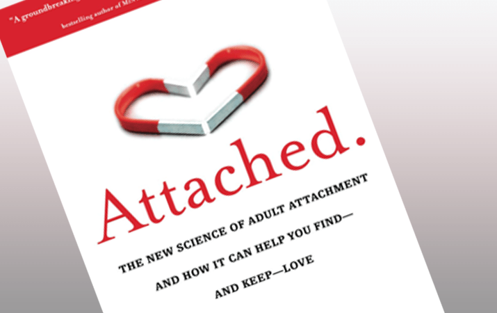
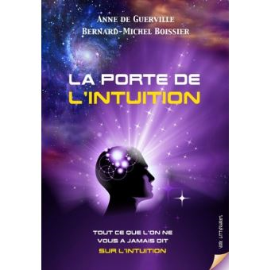
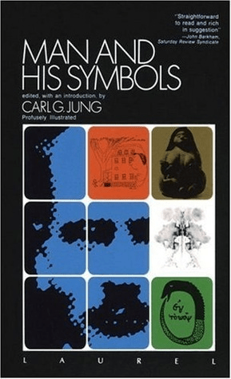
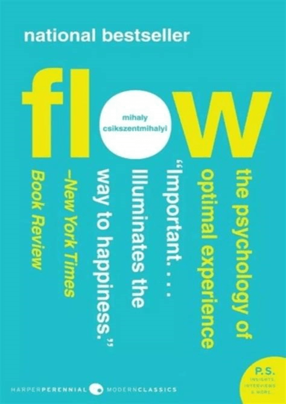
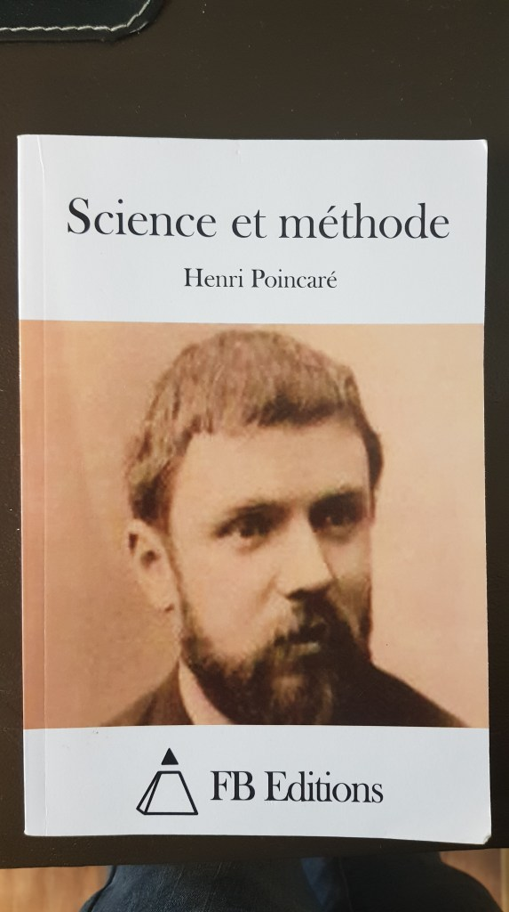
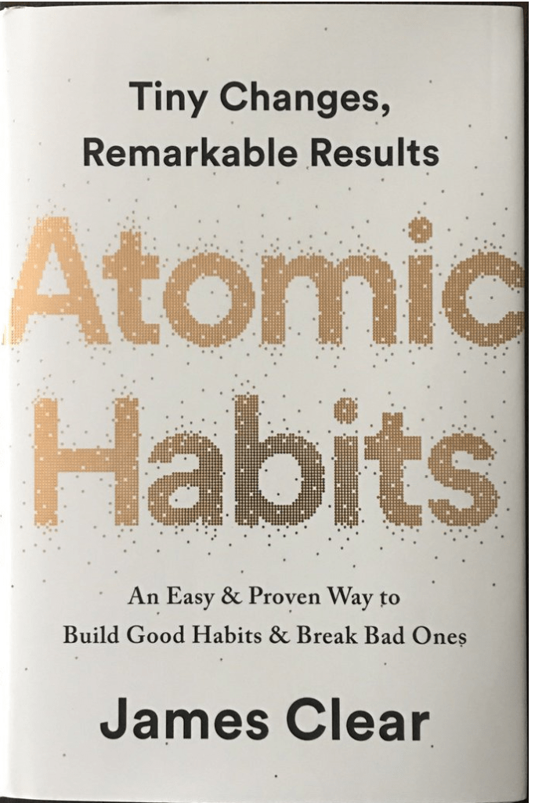
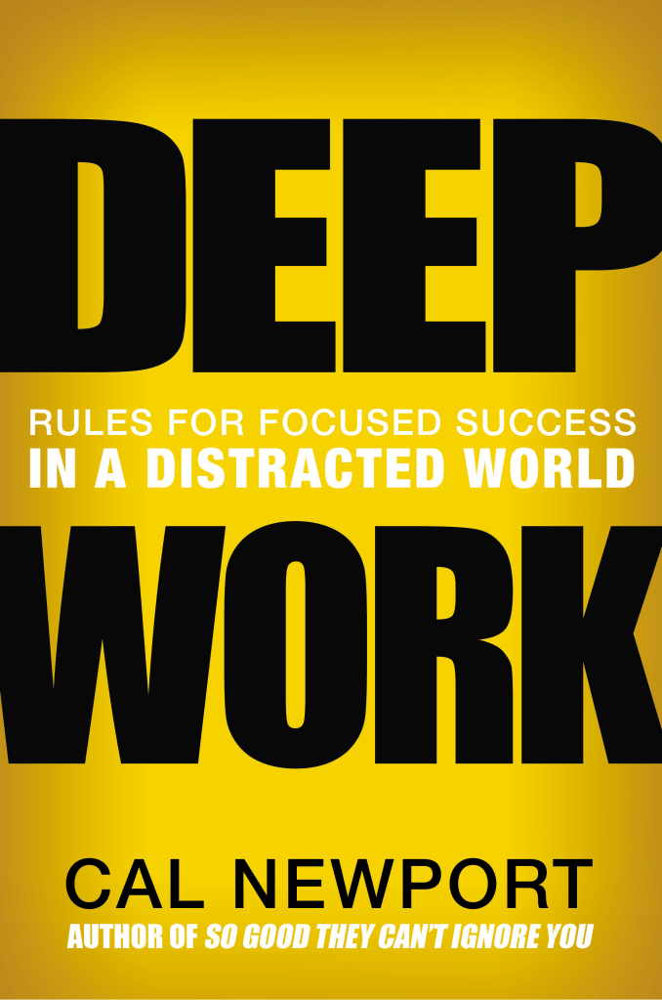

Bonjour, aujourd’hui petit top à la con sur des livres que j’ai lu l’année passée.

Ça n’a évidemment aucun sens de classer des œuvres, donc c’est surtout une sélection de 7 des livres qui m’ont apporté beaucoup de valeur en 2021. _Si vous voulez une deuxième partie, prévenez-moi en commentaire._

Je précise juste que je ne vais pas mentionner de livres religieux dans ce classement – Tout simplement parce que je les lis différemment - . Je ne parlerais pas non plus de livres de maths ou de physique pour les mêmes raisons.

L’objectif c’est de te donner un peu de matière concrète pour répondre à la fameuse question que je reçois souvent : _‘’Par où commencer ?’’._ Donc, si un de ces thèmes te parle, piques-en un et regarde le livre.

Je ne fais pas ici de résumé de ces livres parce que je ne veux pas spoiler le contenu. Je vais juste essayer de décrire la promesse du livre à chaque fois.

Pour avoir accès à mes e mail secrets, voici le [lien](https://mailchi.mp/043d8982459e/gueyordimnewsletter). J’écris moi-même mes mails, ce n’est pas une séquence automatique ; donc les anciens mails que j’ai envoyé sont perdus pour toujours, mais si vous vous inscrivez maintenant, vous aurez tous les prochains.

N’oubliez pas :

- **_‘’Investissez en vous car vous êtes votre ressource la plus précieuse’’_** Warren Buffet.
- **_‘’On ne sait pas ce qu’on ne sait pas’’_** Moi-même.
- **_‘’L’éducation est l’arme la plus puissante pour développer un pays’’_** Nelson Mandela.

7\. **Attached: The New Science of Adult Attachment and How it can help you Find and keep Love** par _Amir Levine_ et _Rachel Heller_

<figure>

<figcaption>

[janesteinbergmft.com](https://janesteinbergmft.com/attached-book-by-levine-heller.html/)

</figcaption>

</figure>

Alors, le registre dans lequel _Attached_ s’inscrit est une branche de la psychologie qu’on appelle la **théorie de l’attachement**. Cette branche cherche à expliquer comment et pourquoi nous établissons des liens entre nous.

Dans le livre _Attached_, Amir Levine et Rachel Heller abordent cette thématique sous l’angle des relations amoureuses ; et ils font une classification des profils amoureux qui font que certains couples réussissent sur le long terme alors que d’autres échouent lamentablement.

Voici le [lien](https://www.amazon.fr/Attached-Science-Adult-Attachment-Help/dp/1585429139/ref=sr_1_2?__mk_fr_FR=%C3%85M%C3%85%C5%BD%C3%95%C3%91&crid=1LAOVQF2VKM1N&keywords=attached&qid=1642265554&sprefix=attached%2Caps%2C1240&sr=8-2) pour acheter le livre (en anglais).

6\. **La porte de l’intuition : Tout ce que l’on ne vous a jamais dit sur l’intuition** par _Anne de Guerville_ et _Bernard Michel Boissier_

<figure>

<figcaption>

[livre.fnac.com](https://livre.fnac.com/a14773733/Bernard-Michel-Boissier-La-porte-de-l-Intuition)

</figcaption>

</figure>

Ce livre est une Masterclass ! Alors, Bernard Michel Boissier est un neuroscientifique français très âgé – Il a 81 ans aujourd’hui – mais il parait toujours très jeune. Il a rencontré Carl Gustav Jung à 20 ans, et c’est à partir de là qu’il a viré dans LA neuroscience – différent des neurosciences – . LA neuroscience est la science du corps, du cerveau et de l’Esprit.

Dans ce livre – Que Bernard a écrit à 90% - , il nous fait une très belle description de l’intuition, mais aussi de la conscience ; et réponds à de grandes questions telles **l’origine de l’intuition**.

Voici le [lien](https://www.methodebmb.com/livres/) pour acheter le livre (en français).

5\. **Man and his Symbols** par _Carl Gustav Jung_

<figure>

<figcaption>

[goodreads.com](https://www.goodreads.com/book/show/123632.Man_and_His_Symbols)

</figcaption>

</figure>

Si vous êtes habitué à me lire, vous devez forcément connaitre Carl Gustav Jung. C’est le successeur de Freud, mais il l’a trahi dans sa pensée (comme tout bon disciple philosophique). La raison de cette trahison était que Jung a fini par s’écarter d’une vision trop déterministe et matérialiste du comportement humain : Il croyait en l’existence de l’esprit – Il était Chrétien - . Etant moi-même Chrétien, je me suis bien plus retrouvé dans la pensée de Jung.

Alors, _Man and his Symbols_ est l’unique livre de cette sélection que je n’ai pas lu en intégralité. C’est un petit pavé d’une 500 aine de pages -écrit en police 8pts- .

Je n’ai lu que les 100 premières pages écrites par Jung lui-même. En effet, c’est en réalité 5 livres condensés dans un document ; chacun des 4 derniers livres est écrit par un des plus proches collaborateurs de Jung (sous sa supervision).

Ce livre parle de **l’importance des symboles** pour les hommes -par exemple, pourquoi nous avons des statues de lions- ; **l’importance, la fonction et l’analyse des rêves** ; **la structure des mythes** ; **l’individuation** ; etc.

Voici le [lien](https://www.amazon.fr/Man-His-Symbols-C-Jung/dp/0440351839/ref=sr_1_1?__mk_fr_FR=%C3%85M%C3%85%C5%BD%C3%95%C3%91&crid=1ZZLZJJ3PA5CN&keywords=man+and+his+symbols&qid=1642266298&sprefix=man+and+his+symbols%2Caps%2C673&sr=8-1) pour acheter le livre (en anglais).

4\. **Flow: The Psychology of optimal experience** par _Mihaly Csikszentmihalyi_

<figure>

<figcaption>

[casaruraldavina.com](https://casaruraldavina.com/pdf/28563-flow-book-by-mihaly-csikszentmihalyi-pdf-803-396.php)

</figcaption>

</figure>

Flow c’est un des livres de psychologie positive les plus influents du 21-ème siècle. Il prend à contre-pied le mouvement du développement personnel qui pullule de fadaises et de recettes du _‘bonheur’_ ou du _‘succès’._

Au contraire, Mihaly cherche à décrire ce qu’il appelle **l’expérience optimale**. C’est n’est pas le bonheur, mais un état de conscience dans lequel on est tellement pris dans une activité que le temps disparait. Ce qui correspond à la **zone** dans le mangas Kuroko no Basket.

Voici le [lien](https://www.amazon.fr/Flow-Psychology-Experience-Mihaly-Csikszentmihalyi/dp/0061339202/ref=sr_1_1?__mk_fr_FR=%C3%85M%C3%85%C5%BD%C3%95%C3%91&crid=3TW2VL097Y9N1&keywords=flow&qid=1642266558&sprefix=flow%2Caps%2C237&sr=8-1) pour acheter le livre (en anglais).

3\. **Science et Méthode** de _Jules Henri Poincaré_

<figure>

<figcaption>

Photo prise moi même (par manque d'images en ligne)

</figcaption>

</figure>

Vous avez peut-être déjà entendu parler de Poincaré: C'est un mathématicien français mort le siècle dernier - La formule de Poincaré c’est celle qui donne la probabilité de l’union en fonction de celle des intersections - .

Je vous rassure, Science et Méthode ce n’est pas un livre de maths, mais plutôt un livre de philosophie des sciences.

Personnellement, c’est un livre qui m’a beaucoup marqué parce qu’il m’a donné les réponses aux questions : Qu’est-ce que la science ? Quelle est la vraie importance de la science dans le développement d’un pays ? Quel est le statut des mathématiques ? Qu’est ce que le hasard ?

C’est de ce livre qu’est tiré la citation : _‘’Les mathématiques c’est l’art de donner un même nom à des choses différentes’’._

Voici le [lien](https://www.amazon.fr/Science-m%C3%A9thode-Henri-Poincar%C3%A9/dp/1514758911/ref=sr_1_1?__mk_fr_FR=%C3%85M%C3%85%C5%BD%C3%95%C3%91&crid=2WCPVO3QBWWVY&keywords=science+et+m%C3%A9thode&qid=1642266841&sprefix=science+et+m%C3%A9thode%2Caps%2C261&sr=8-1) pour acheter le livre (en français).

2\. **Atomic Habits: Tiny changes, remarkable results – An Easy & Proven Way to Build Good Habits & Break Bad Ones** par _James Clear_

<figure>

<figcaption>

[themanlyclub.com](https://www.themanlyclub.com/blog/atomic-habits-by-james-clear-quick-book-overview/)

</figcaption>

</figure>

Si vous avez des comportements que vous voulez changez, ce n’est pas avec des petites tactiques ou bien quelques conseils glanés un peu partout que vous y arriverez. Il vous faut comprendre en profondeur l’origine de votre mal pour arracher le problème à la racine.

Ce livre est une Master Class qui vous permet de le faire.

Voici le [lien](https://www.amazon.fr/Atomic-Habits-Proven-Build-Break/dp/1847941834/ref=sr_1_1?crid=2PQOAXG9RNJU7&keywords=atomic+habits&qid=1642267169&sprefix=atomic%2Caps%2C212&sr=8-1) pour acheter le livre (en anglais).

1. **Deep Work: Rules for Focused success in a distracted World** par _Cal Newport_

<figure>

<figcaption>

[knowledge.wharton.upenn.edu](http://knowledge.wharton.upenn.edu/article/deep-work-the-secret-to-achieving-peak-productivity/)

</figcaption>

</figure>

Cal Newport est un matheux issu du MIT. Dans le livre Deep Work, il théorise d’une manière pratique les règles pour réussir à produire des résultats remarquables grâce à la faculté à se concentrer intensément.

Excellent livre : Je vous recommande.

C’est un livre qui m’a traumatisé. Pour vous dire à quel point, la seule autre fois que j’avais été autant choqué, c’était la première fois que j’avais vu Gohan se transformer en Super Saiyan 2 contre Cell dans Dragon ball Z.

Voici le [lien](https://www.amazon.fr/Deep-Work-Focused-Success-Distracted/dp/0349411905/ref=sr_1_1?__mk_fr_FR=%C3%85M%C3%85%C5%BD%C3%95%C3%91&crid=3N9YLS5FLD774&keywords=deep+work+cal+newport&qid=1642267430&sprefix=deep+work+cal+newport%2Caps%2C747&sr=8-1) pour acheter le livre (en anglais).

a

Les livres qui ont de la valeur ne sont pas ceux qui ont été lus, mais ceux qui sont encore non lus. Parce qu’ils représentent la connaissance manquante, et donc l’espoir réel d’un lendemain meilleur.

Je rappelle le [lien](https://mailchi.mp/043d8982459e/gueyordimnewsletter) pour avoir accès à mes e-mail secrets.

Bon weekend,

Alain Didier.
